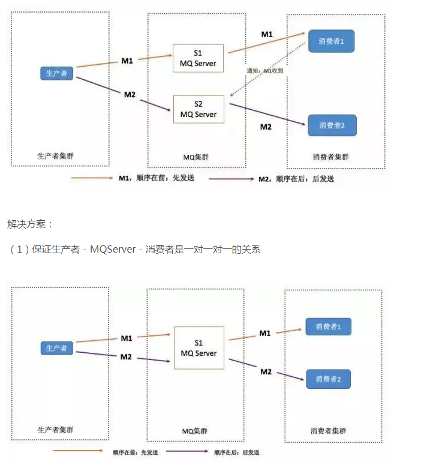
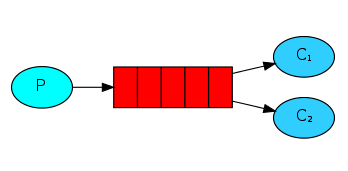
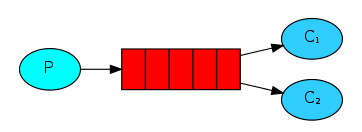
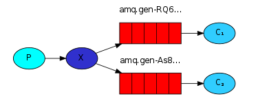
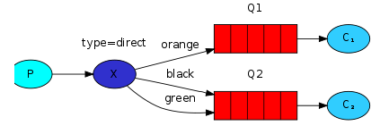
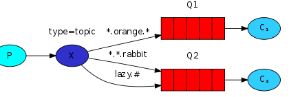

# 0. 学习目标

- 能够说出什么是消息中间件
- 能够安装RabbitMQ
- 能够编写RabbitMQ的入门程序
- 能够说出RabbitMQ的5种模式特征
- 能够使用Spring整合RabbitMQ

# 1.消息中间件概述

## 1.1 什么是消息中间件

​	MQ全称为Message Queue，消息队列是应用程序和应用程序之间的通信方式

- ​	为什么使用MQ

  ​    在项目中，可将一些无需即时返回并且耗时的操作提取出来，进行异步操作，而这种异步处理的方式大大节省了服务器的请求响应时间，从而提高了系统的吞吐量。

- 开发中消息队列通常有如下应用场景：

  1、任务**异步**处理

  将不需要同步处理的并且耗时长的操作由消息队列通知消息接收方进行异步处理。提高了应用程序的响应时间。

  2、应用程序**解耦合**

  MQ相当于一个中介，生产方通过MQ与消费方交互，它将应用程序进行解耦合。

  3、**削峰填谷**

  如订单系统，在下单的时候就会往数据库写数据。但是数据库只能支撑每秒1000左右的并发写入，并发量再高就容易宕机。低峰期的时候并发也就100多个，但是在高峰期时候，并发量会突然激增到5000以上，这个时候数据库肯定卡死了。

  

  消息被MQ保存起来了，然后系统就可以按照自己的消费能力来消费，比如每秒1000个数据，这样慢慢写入数据库，这样就不会卡死数据库了。

  

  但是使用了MQ之后，限制消费消息的速度为1000，但是这样一来，高峰期产生的数据势必会被积压在MQ中，高峰就被“削”掉了。但是因为消息积压，在高峰期过后的一段时间内，消费消息的速度还是会维持在1000QPS，直到消费完积压的消息,这就叫做“填谷”

  

## 1.3. 消息队列产品

市场上常见的消息队列有如下：

- ActiveMQ：基于JMS
- ZeroMQ：基于C语言开发
- RabbitMQ：基于AMQP协议，erlang语言开发，稳定性好
- RocketMQ：基于JMS，阿里巴巴产品
- Kafka：类似MQ的产品；分布式消息系统，高吞吐量

# mq 常问的面试题

## 为什么使用mq  mq的优点

简答:   

-   异步处理   - 相当于传统的串行、并行方式，提高了系统吞吐量。
-   应用解耦  - 系统间通过消息通信，不用关心其他系统的处理
-   流量消峰 - 可以通过消息队列长度控制请求量；可以缓解短时间内的高并发请求
-   日志处理  -  解决大量日志传输
-   消息通讯 -  消息队列一般都内置了高效的通信机制，因此也可以用在纯的消息通讯,比如实现点对点消息队列或者聊天室等

## mq的优缺点

​	优点 ： 上面所述    就是在特殊场景下有其对应的好处，**解耦，异步 ，消峰**

​	缺点  :    **系统可用性降低**   如 消息队列突然挂了导致程序不可用

​					**一致性问题**   A B 两个服务，A服务成功，B服务失败   

## mq常见问题			 	

- 消息的顺序问题
- 消息的重复问题（幂等性）

**消息的顺序问题?**

​	消息有序指的是可以按照消息的发送顺序来消费。

​	假如生产者产生了 2 条消息：M1、M2，假定 M1 发送到 S1，M2 发送到 S2，如果要保证 M1 先于 M2 被消费，怎么做？

  就是 生产者要跟MQ Server是一对一的关系  

**消息的重复问题**

重复原因：造成消息重复的根本原因是：网络不可达   

问题描述： 如果消费端收到两条一样的消息，应该怎样处理？

解决方案： 消费端处理消息的业务逻辑保持幂等性，只要保持幂等性，不管来多少条重复消息，最后处理的结果都一样，保证每条消息都有唯一编号且保证消息处理成功与去重表的日志同时出现，利用一张日志表来记录已经处理成功消息的ID，如果新的消息ID已经在日志表中，那么就不再处理这条消息

## RabbitMQ基本概念

Broker :  简单来说就是消息队列服务器实体

Exchange： 消息交换机，它指定消息按什么规则，路由到哪个队列

Queue: 消息队列载体，每个消息都会被投入到一个或多个队列

Binding: 绑定，它的作用就是把exchange和queue按照路由规则绑定起来

Routing key:路由关键字，exchange根据这个关键字进行消息投递

VHost： vhost 可以理解为虚拟 broker ，即 mini-RabbitMQ server。其内部均含有独立的 queue、exchange 和 binding 等，但最最重要的是，其拥有独立的权限系统，可以做到 vhost 范围的用户控制。当然，从 RabbitMQ 的全局角度，vhost 可以作为不同权限隔离的手段（一个典型的例子就是不同的应用可以跑在不同的 vhost 中）。
Producer: 消息生产者，就是投递消息的程序

Consumer：消息消费者，就是接受消息的程序

Channel： 消息通道，在客户端的每个连接里，可建立多个channel，每个channel代表一个会话任务

由Exchange，Queue，RoutingKey三个才能决定一个从Exchange到Queue的唯一线路

## RabbitMQ的工作模式

- simple模式（即最简单的收发模式）

  

  1.生产者产生消息，将消息放入队列

  2.消费者监听消息队列，如果队列中有消息，就消费掉，消息被拿走后，自动从队列中删除

  

- work工作模式(资源的竞争)

1 生产者将消息放入队列消费者可以有多个，消费者1 消费者2 同时监听同一个队列，消息被消费，C1 C2共同抢当前的消息队列内容，谁先拿到谁负责消费消息

- publish/subscribe发布订阅（共享资源）

  

  1.每个消费者监听自己的队列

  2.生产者将消息发给broker，由交换机将消息转发到绑定此交换机的每个队列，每个绑定交换机的队列都将接受到消息

- routing路由模式

  

  1.消息生产者将消息发送给交换机按照路由判断，路由是字符串（info）当前产生的消息携带路由字符（对象的方法），交换机根据路由的key，只能匹配上路由key对应的消息队列，对应的消费者才能消费消息

  2.根据业务功能定义路由字符串

  3.从系统的代码逻辑中获取对应的功能字符串,将消息任务扔到对应的队列中。

  4.业务场景:error 通知;EXCEPTION;错误通知的功能;传统意义的错误通知;客户通知;利用key路由,可以将程序中的错误封装成消息传入到消息队列中,开发者可以自定义消费者,实时接收错误;
  ————————————————
  版权声明：本文为CSDN博主「ThinkWon」的原创文章，遵循CC 4.0 BY-SA版权协议，转载请附上原文出处链接及本声明。
  原文链接：https://thinkwon.blog.csdn.net/article/details/104588612

- topic主题模式（路由模式的一种）

1.星号井（* #）号代表通配符

2.星号代表多个单词，#代表一个单词

3.路由功能添加模糊匹配

4.消息生产者产生消息，把消息交给交换机

5.交换机根据key的规则模糊匹配到对应的队列，由队列的监听消费者接受消息消费

