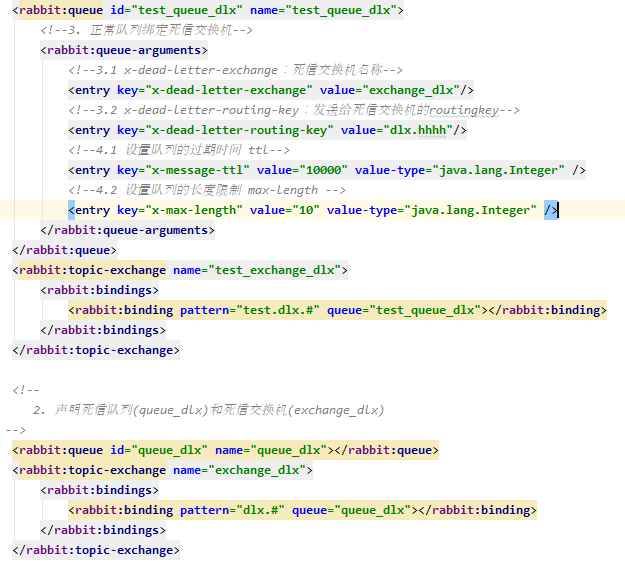

# rabbitmq高级特性

## 消息的可靠投递

## ttl

 指消息过期

## 死信队列

​	死信交换机 （DDL），当消息成为Dead message后，可以被重新发送到另一个交换机

**死信队列小结**

- ​	死信交换机和死信队列和普通的没有区别

- ​    当消息成为死信后，如果该队列绑定了死信交换机，则消息会被死信交换机重新路由到死信队列

-    消息成为死信的三种情况

  ​	1.队列消息长度到达限制  （生产端）

  ​	2.消费者拒接消费消息，并且不重回队列   (消费端)

  ​	3.原队列存在消息过期设置，消息到达超时时间未被消费    （生产端）

## 延迟队列

概念：  延迟队列，即消息进入队列后不会立即被消费，只有到达指定时间后，才会被消费

​		需求: 1. 下单后，30分钟未支付，取消订单，回滚库存

​					2.新用户注册成功7天后，发送短信问候

​		实现方式; 

​				1.定时器  时间轮询

​				2.延迟队列

**延迟队列小结**

- ​	延迟队列  指消息进入队列后，可以被延迟一定时间，再进行消费

-    RabbitMQ没有提供延迟队列功能，但是可以使用：TTL+DLX来实现延迟队列的效果

  

​	