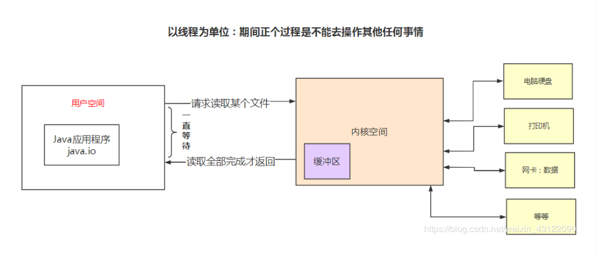

参考文章

http://mp.weixin.qq.com/s/7izjL2obMxctn2B4n6yAiQ

https://blog.csdn.net/weixin_43122090/article/details/105462088

# BIO、NIO、AIO、Netty

​	在了解不同的IO之前先了解：同步与异步，阻塞与非阻塞的区别

​	同步：一个任务的完成之前不能做其它操作，必须等待（等于在打电话）

​	异步：一个任务的完成之前，可以进行其它操作（等于在聊QQ）

​	阻塞：是相当于CPU来说的，挂起当前线程，不能做其他操作只能等待

​	非阻塞：无须挂起当前线程，可以去执行其他操作

### 什么是IO

​	在java中I/O是以流为基础进行数据进行输入输出的，所有数据被串行化（就是数据要按顺序进行输入输出）写入输出流，简单来说就是java通过io流方式和外部设备进行交互

​	在java类库中，IO部分的内容很庞大，因为它涉及到领域很广泛，标准输入输出，文件的操作，网络上的数据传输流，字符串流，对象流等

​	比如程序从服务器上下载图片，就是通过流的方式从网络上以流的方式到程序中 ，再到硬盘中

### 什么是BIO

​		同步并阻塞，服务器实现一个连接一个线程，即客户端在连接请求时服务端就需要启动一个线程进行处理，没处理完之前此线程不能做其他操作（如果是单线程情况下，我传输文件很大呢？）当然可以通过线程池机制改善，BIO方式适用于连接数目比较小且固定的架构，这种方式对服务器资源要求比较高，并发局限于应用中

### 什么是NIO

​	同步非阻塞,服务器实现一个连接一个线程，即客户端发送的连接请求都会注册到多路复用器上，**多路复用器轮询**到连接有I/O请求时才启动一个线程进行处理，NIO方式适用于连接数目多且连接比较短（轻操作）的架构，比如聊天服务器，并发局限于应用

### 什么是AIO

​	异步非阻塞，服务器实现模拟为一个有效请求一个线程，在客户端的I/O请求都是由操作系统先完成了再通知服务器应用去启动线程去处理，AIO方式使用与连接数目多且连接比较长（重操作）的架构，比如相册服务器，充分调用操作系统参与并发操作，编程比较复杂，JDK1.7之后开始支持。

### 什么Netty

BIO和NIO、AIO的区别

- ​	BIO是阻塞的，NIO是非阻塞的
-    BIO 是面向流的，只能单向读写，NIO是面向缓冲的，可以双向读写
-    使用BIO做Socket连接时，由于单向读写，当没有数据时，会挂起当前线程，阻塞等待，为防止影响其他连接，需要为每个连接新建线程处理，然后系统资源是有限的，不能过多的新建线程，线程过多带来线程上下文的切换，从来带来更大的性能损耗，因此需要使用NIO进行BIO多路复用,使用一个线程来监听所有Socket连接，使用本线程或者其他线程处理连接
- AIO是非阻塞，以异步方式发起IO操作，当IO操作进行可以去做其他操作，由操作系统内核空间提醒IO操作已完成

## IO流的分类

### 按照读写的单位大小来分：

- 字符流:  以字符为单位，每次次读入或读出是16位数据，其只能读取字符类型数据

- 字节流：以字节为单位，每次次读入或读出是8位数据，可以读任何类型数据，图片，文件，音乐视频等

### 按照实际IO操作来分：

- ​	输出流： 从内存读出到文件，只能进行写操作

-    输入流： 从文件读入到内存中，只能进行读操作    

  注意：输出流可以帮助我们创建文件，而输入流不会

###  按照读写时是否直接与硬盘，内存等节点连接分

- ​	节点流：直接与数据库相连，读入或读出
- ​    处理流：也叫包装流 是对一个对于已存在的流的连接进行封装，通过所封装的流的功能调用实现数据读写，如添加个Buffering缓冲区

## 什么是内核空间

## 五种IO模型 

​	注意 ：我这里的用户空间就是应用程序空间

https://mp.weixin.qq.com/s?__biz=Mzg3MjA4MTExMw==&mid=2247484746&idx=1&sn=c0a7f9129d780786cabfcac0a8aa6bb7&source=41#wechat_redirect

1.阻塞BIO（blocking I/O）

- ​		A拿着一支鱼竿在河边钓鱼，并且一直在等鱼竿前等，在等的时候不做其他的事情，十分专心，只有鱼上钩的时，才结束掉等的动作

- ​		在内核将数据准备好之前，系统调用会一直等待所有的套接字，默认的是阻塞方式

  

2.非阻塞NIO（noblocking I/O）

​		B也在河边钓鱼，但是B不想将自己的所有时间都花费在钓鱼上，在等鱼上钩这个时间段中，B也在做其他的事情（比如看书，读报纸，打王者农药），但B在做这些事情的时间，每个一个固定的时间检查鱼是否上钩，一旦检查到有鱼上钩，就停下手中的事情，把鱼钩上来，B在检查鱼竿是否有鱼，是一个轮询的过程

3.信号驱动IO（signal blocking I/O）

​	C 也在河边钓鱼，但与AB不同的是，C比较聪明，他给鱼竿上安装一个报警器，当有鱼上钩，这个报警器就会响，c就会将鱼钩上来

信号驱动IO模型，应用进程告诉内核，当数据报准备好的时候，给我发送一个信号，对SIGIO信号进行捕捉，并且调用我的信号处理函数来获取数据报

4.IO多路转接（I/O multiplexing） IO复用模型 （通过管道）

D同样在河边钓鱼，为了保证可以最短的时间钓到更多鱼，他买了多根鱼竿，同时钓鱼，然后看那个鱼竿有鱼儿咬钩了，就把那个鱼竿上面的鱼钩起来

​	多个进程的IO可以注册到同一个管道上，这个管道会统一和内核进行交互，当管道中的某个请求需要的数据准备好之后，进程再把对应的数据拷贝到用户空间中

5.异步AIO（asynchronous I/O）

​		F采用一种高科技钓鱼竿，即全自动钓鱼竿，可以自动感应鱼上钩，自动收竿，更厉害的可以自动把鱼放进鱼篓里，然后，通知我们的鱼眼睛够到了，他就继续去钓下一条鱼了

### 五种IO模型对比

# NIO与IO区别

思路：首先肯定要从NIO流是非阻塞IO而IO流是阻塞IO说起，然后，可以从NIOdine3个核心组件/特性为NIO带来的一些改进来分析，如果，你把这些都回答上了我觉得你对于NIO就有了更为深入一点的认识，面试官问到你这个问题，你也能很轻松的回答上来了

解:

- ​	IO流是阻塞的，NIO流是不阻塞的

  ​	javaNIO使我们可以进行非阻塞IO操作，比如说，单线程中从通道读取数据到buffer，同时可以继续做别的事情，当数据读取到buffer中后，线程再继续处理数据，写数据也是一样的，另外，非阻塞写也是如此，一个线程请求写入一些数据到某通道，但不需要等待它完全写入，该线程在此期间不能再干任何事情了

- IO面向流（Stream），而NIO面向缓冲区（Buffer）

- Channel（通道） NIO通过Channel（通道）进行读写

  通道是双向的，可读也可写，而流的读写时单向的，无论读写，通道只能和Buffer交互，因为buffer，通道可以异步地读写

- selector （选择器）

  NIO有选择器，而IO没有

  选择器用于使用单个线程处理多个通道，因此，它需要较小的线程来处理这些通道，线程之间的切换对于操作系统来说昂贵的，因此，为了提高系统效率选择器是有用的

总结:

了解几个名词的概念

1 什么是同步？ 
2 什么是异步？ 
3 什么是阻塞？ 
4 什么是非阻塞？ 
5 什么是同步阻塞？ 
6 什么是同步非阻塞？ 
7 什么是异步阻塞？ 

8 什么是异步非阻塞？

举个生活例子：如果你想吃一份宫爆鸡丁盖饭

​		同步阻塞（BIO）： 你到饭馆点餐，然后在哪等着，还要一边喊，好了没啊！

​		单通道，一请求一线程 

​        阻塞原因：socket.accept()`、`socket.read()`、`socket.write()` 涉及的三个主要函数都是同步阻塞的				

​		    

​		同步非阻塞（NIO）：

​				在饭馆点完餐之后，就去遛狗了，不过馏一会儿，就会饭馆喊一声：好了没啊！（轮询操作）

​		异步阻塞：

​			馏狗的时候，接到饭馆电话，说饭做好了，让你亲自去拿

​		异步非阻塞（AIO）：

​			饭馆打电话说，我们知道你的位置，一会给你送过来，安心遛狗就可以了

1 同步：指的是用户进程触发IO操作并等待或者轮询的区查看IO操作是否就绪，自己上街买衣服，自己亲自干这件事，别的事干不了

2 异步：异步指用户进程触发IO操作一会便开始做自己的事情，而当io操作已经完成的时候回得到IO完成的通知（异步的特点就是通知）告诉朋友自己合适衣服的尺寸，大小，颜色，让朋友委托去卖，然后自己可以去干别的事

3阻塞：所谓阻塞方式的意思是指，当试图对该文件描述符进行读写时，如果当时没有东西可读，或者暂时不可写，程序就进入等待状态，直到有东西可读或者可写为止

4： 非阻塞：非阻塞状态下，如果没有东西可读，或者不可写，读写函数就马上返回，而不是等待，银行里取款办业务时，领取一张小票，领取完后我们自己可以玩玩手机，或者与别人聊聊天，当轮我们时，银行的喇叭会通知，这时候我们就可以去了。

 IO 同步阻塞

 NIO 同步非阻塞

AIO 异步非阻塞

