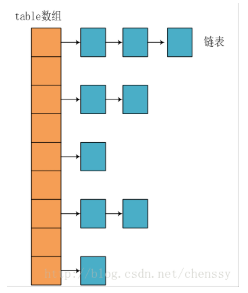
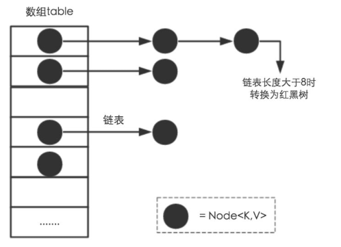
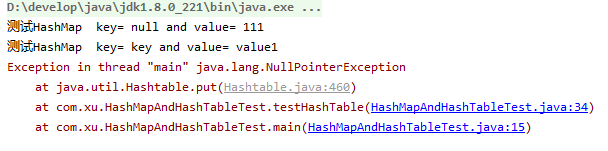
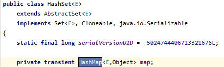

# HashMap

## 简介

​		hashMap主要存放键值对，它基于哈希表的Map接口实现，是最常用的java集合之一

​		数组的特点是： 寻址容易，插入和删除困难

​       链表的特点是：寻址困难，插入和删除容易

​		红黑树的特点是： 

​		jdk1.8之前： HashMap由数组+链表组成的，数组是HashMap的主体，链表则是主要为了解决哈希冲突而存在的（拉链法解决冲突）

​	

​	所谓的“拉链法”就是：将链表和数组相结合。也就是说创建一个链表数组，数组每一格就是一个链表，若遇到哈希冲突，则将冲突的值加到链表中即可


​		jdk1.8之后：当链表长度大于阈值（默认为8）时，将链表转化为红黑树（将链表转换红黑树前会判断，如果当前数组的长度小于64，那么会选择先进行扩容，而不是转化为红黑树），以减少搜索时间，具体可以参考treeifyBin方法			



相比java1.8之前的版本，jdk1.8在解决哈希冲突时由了较大的变化，当链表长度大于阈值（默认为8）时，将链表转化为红黑树，以减少搜索时间


**我的理解  首先  table数组的长度要大于64 并且链表的长度大于8（默认为8） 才会把链表转换成红黑树**

将链表转换成红黑树前会判断，如果当前数组的长度小于64，那么会选择先进行扩容，而不是转化成红黑树

​	将链表转换成红黑树，以减少搜索时间


##  HashMap 的 hash 算法和寻址算法

​	jdk1.8之后 hash方法 源码

```java
static final int hash(Object key) {
    int h;
    return (key == null) ? 0 : (h = key.hashCode()) ^ (h >>> 16);
}
```

```properties
h = key.hashCode()  表示h是key对象的hashcode返回值
h >>> 16 是h右移16位，因为int是4字节,32位，所以右移16位后变成：左边16个0+右边原h的高16位
最后把这个两个进行异或或返回
	异或： 二进制位运算，如果一样返回0,不一样则返回1
	例如： 两个二进制110 和100 进行异或  110^100	结果 = 010
```

​	**首先，会判断key是否为null  为null的话直接返回0，不为null 用key值去拿去hashcode ，然后异或运算 h值右移16位  得到他的一个地址**

## loadFactor加载因子

​	loadFactor加载因子是控制数组存放数据的疏密程度，LoadFactor越趋近于1，那么数组中存放的数据（entry）也就越多，也就越密，也就会让链表的长度增加，loadFactor越小，也就是趋近于0，数组存放的数据（entry）也就越少，也就是越稀疏

原因： loadFactor太大导致查找元素效率低，大小导致数据利用率低，存放的数据会很分散，loadFactor默认为0.75

给定的默认容量为16，负载因子为0.75，Map在使用的过程中不断往里面存放数据，当数据达到了16*0.75=12就需要将当前的容量进行扩容，而扩容这个过程涉及到rehash，复制数据等操作，所以非常消耗性能


# 面试题库 及回答

## HashMap 和HashTable的区别

​			1.线程是否安全： HashMap 是非线程安全的，HashTable是线程安全的，因为HashTable内部方法基本都经过Synchronized修饰（保证线程安全的话就使用ConcurrentHashMap）

​			2.效率 ：因为线程安全的问题，HashMap要比hashTable效率高一点

​			3对Null key 和Null value 的支持， HashMap可以存储Null的key和value，但null作为键只能有一个，null作为值可以为多个；HashTable不允许null键和null值，否则会抛出 NullPointerException。

​		

```java
/**
 * hashMap 与hashTable的使用
 */
public class HashMapAndHashTableTest {

    public static void main(String[] args) {
        testHashMap();
        testHashTable();
    }
    /**
     * 判断HashMap   是否可以保存key-value  null-null
     */
    public  static  void  testHashMap(){
        HashMap<Object, Object> obj = new HashMap<>();
        obj.put(null,null);
        obj.put(null,111); //该值可以将上面的key进行覆盖
        obj.put("key","value");
        obj.put("key","value1");

        for (Object key : obj.keySet()) {
            System.out.println("测试HashMap  key= "+ key + " and value= " + obj.get(key));
        }

    }
    public  static  void  testHashTable(){
        Hashtable<Object, Object> obj = new Hashtable<>();
        obj.put(null,null);
        obj.put("key","value");
        for (Object key : obj.keySet()) {
            System.out.println("测试HashTable  key= "+ key + " and value= " + obj.get(key));
        }
    }
}
```

​			

​		4.初始容量大小 和每次扩充容量大小的不同   

​				hashTable  的默认的初始大小为11，之后每次扩充，容量变为原来的2n+1

​				HashMap  的默认初始化大小为16，之后每次扩充，容量为原来的2倍，

​				Hashtable 创建时给定容量初始值，那么HashTable会直接使用你给定的大小

​                 HashMap 创建时给定容量初始值，会将其扩充为2的幂次方 `tableSizeFor()`方法保证

```java
/**
 * Returns a power of two size for the given target capacity.
 */
static final int tableSizeFor(int cap) {
    int n = cap - 1;
    n |= n >>> 1;
    n |= n >>> 2;
    n |= n >>> 4;
    n |= n >>> 8;
    n |= n >>> 16;
    return (n < 0) ? 1 : (n >= MAXIMUM_CAPACITY) ? MAXIMUM_CAPACITY : n + 1;
}
```


## HashMap 和HashSet区别

​		 如果你看过HashSet源码的话就应该知道： HashSet底层就是基于HashMap实现的




| HashMap                          | HashSet                                                      |
| -------------------------------- | ------------------------------------------------------------ |
| 实现了Map接口                    | 实现了Set接口                                                |
| 存储键值对                       | 仅存储对象                                                   |
| 调用put（）方法中添加对象        | 调用add()方法向Set中添加对象                                 |
| HashMap使用键（key）计算HashCode | HashSet使用成员对象来计算Hashcode值，对于两个对象来说hashcode可能对象，所以equals（）方法用来判断对象的相等性 |

###   hashSet 如何检测重复的？

​		当你把对象加入HashSet时，HashSet会先计算的HashCode值来判断对象加入的位置，同时也会与其他的对象的hashCode值作比较，如果没有相符的hashcode,HashSet会假设对象没有重复出现，但是如果发现有相同Hashcode值的对象，这时会调用equals方法来检查hashcode相等的对象是否真的相同，如果两者相同，HashSet就不会让加入操作成功

### hashCode与equals的相关规定：

- 如果两个对象相等，则hashCode一定相同
- 两个对象相等，对两个equlas方法返回true
- 两个对象有相同的hashCode值，他们也不一定是相等的
- 综上，equlas方法被覆盖过，则hashCode方法也必须被覆盖
- HashCode方法默认行为是对推上的对象产生独特值，如果没有重写Hashcode()，则该class的两个对象无论如何也不会相等（即使这两个对象指向相同的数据）		

### ==与equlas的区别

- ​	对于基本类型来说，==比较的是值是否相等
-    对于引用类型来说，== 比较的是两个引用是否指向同一个对象地址（两者在内存中存放的地址（堆内存地址）是否指向同一个地方）
-    对于引用类型（包括包装类型来说）equlas如果没有被重写，对比它们的地址是否相等，如果equlas方法被重写（例如String），则比较的是地址里的内容


## 什么是哈希表？

​	时间复杂度为O(1)  通过关键字一次计算等到的映射地址 

​	[散列表](https://baike.baidu.com/item/散列表/10027933)（Hash table，也叫哈希表），是根据关键码值(Key value)而直接进行访问的[数据结构](https://baike.baidu.com/item/数据结构/1450)。也就是说，它通过把关键码值映射到表中一个位置来访问记录，以加快查找的速度。这个映射函数叫做[散列函数](https://baike.baidu.com/item/散列函数/2366288)，存放记录的[数组](https://baike.baidu.com/item/数组/3794097)叫做[散列表](https://baike.baidu.com/item/散列表/10027933)。


## 哈希冲突？

​				当我们对某个元素进行哈希算法，得到了同一个存储地址（内存地址），这就是所谓的哈希冲突

### 			HashMap中如何解决哈希冲突的？

​					HashMap是由数据+链表+红黑树组成的，数组是hashMap的主体，链表主要是解决hash冲突而存在的，如果定位到数组位置不含链表,那么对于查找，添加等操作很快，仅需一次寻址即可（数组的特点是，查询快，增删慢 O(1)），如果定位到的数组包含链表，对于添加操作，其时间复杂度为O(n),首先遍历链表，存在即覆盖，否则新增，（链表的特点是：寻址困难，插入和删除容易） 所以 ，性能考虑，HashMap的链表出现越少（默认为长度少于8）性能才会越好（超过8 并且数组长度大于64，即把链表转换成红黑树）


# HashMap的工作原理是什么?

​		HashMap内部是通过一个数组实现的，数组里存储的元素是一个Entry实体（jdk为Node）,这个Entry实体主要包含key，value以及执向自身的next指针

​			HashMap是基于hashing实现的，当我们进行put操作时，根据传递的key值得到它的hashCode（HashMap中的hash方法实现的扰动函数），然后再用这个hashcode与数组的长度进行**模运算** 得到int值，就是Entry要存储在数组的位置（下标），当通过get方法获取指定key的值时，会根据这个key算出它的hashCode值（数组下标），根据这个hash值获取数组下标对应的Entry，然后判断Entry里的key，hash值通过equlas（）比较是否与要查找的相同，如果相同，返回value，否则遍历该链表，直到找到为止，否则返回NULL


HashMap是无序的？


