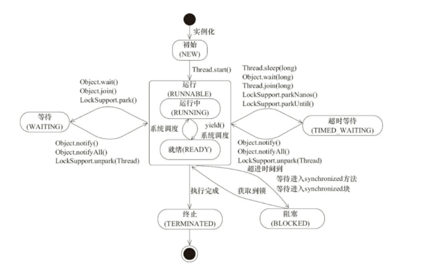
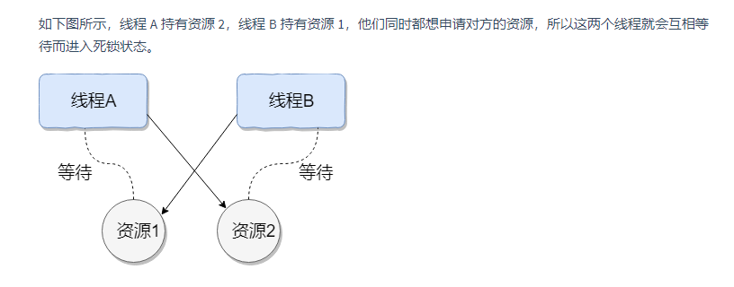
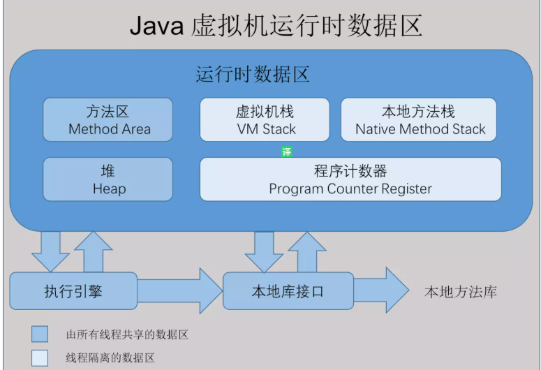
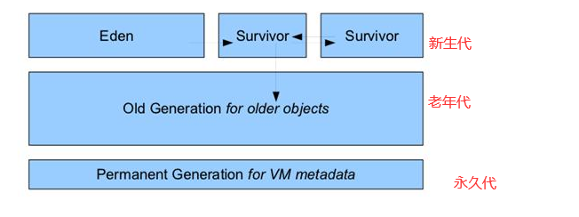
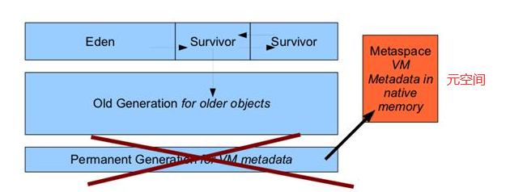
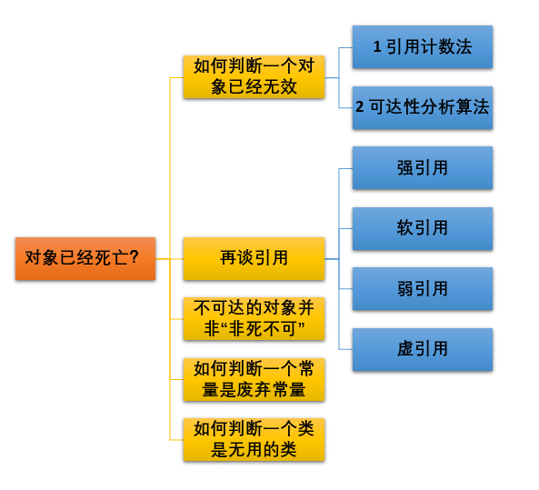
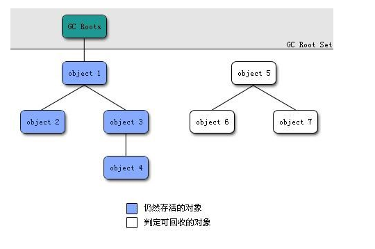
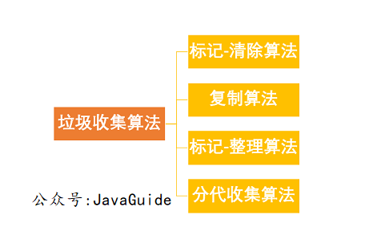
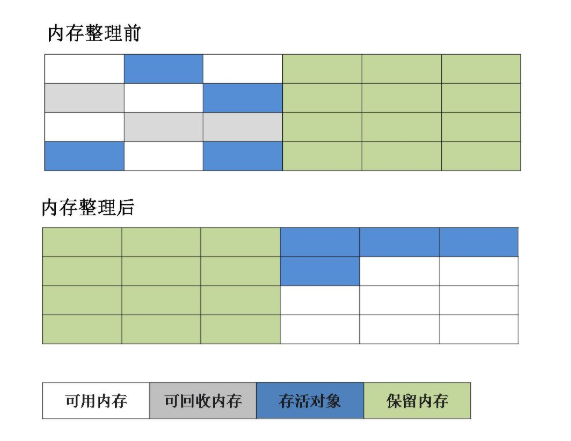
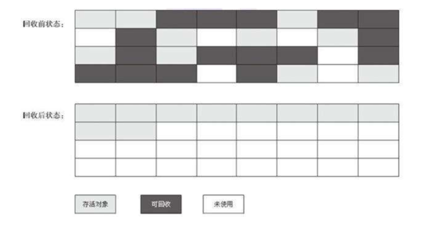

git 提交操作   https://www.cnblogs.com/cxk1995/p/5800196.html

​      修改操作  https://blog.csdn.net/weixin_43823423/article/details/103211985

面试流程：https://segmentfault.com/a/1190000016132561

**面试经验提炼（有帮助）https://segmentfault.com/a/1190000021254273**

hashcode原理讲解  https://www.cnblogs.com/sheseido/p/12098263.html

https://blog.csdn.net/jackfrued/article/details/44921941

**解释内存中的栈(stack)、堆(heap)和方法区(method area)的用法。**

答：通常我们定义一个基本数据类型的变量，一个对象的引用，函数调用的现场保存都使用jvm的栈空间  

​	通过new关键字和构造器创建的对象则放在堆空间，堆是垃圾收集器管理的主要区域，由于现在的垃圾收集器都采用分代收集算法，所以堆空间还可以分为新生代和老生代，方法区和堆都是各个线程共享的内存区域，用于存储已经被jvm加载的类信息，常量，静态变量，jit编译后的代码等数据 

如直接书写的100，hello和常量都是放在常量池中，常量池是方法区的一部分，栈空间操作起来最快，但是栈很小，通常大量的对象都是放在堆空间，栈和堆的大小都可以通过jvm的启动参数来进行调整，栈空间用光了会引发stackOverFlowError,而堆和常量池空间不足会引发outOFMemoryError

**重载（Overload）和重写（Override）的区别。重载的方法能否根据返回类型进行区分？**

答：方法的重载和重写都是实现多态的方式，区别在于前者实现的是编译时的多态性，而后者实现的是运行时的多态性。重载发生在一个类中，同名的方法如果有不同的参数列表（参数类型不同、参数个数不同或者二者都不同）则视为重载；重写发生在子类与父类之间，重写要求子类被重写方法与父类被重写方法有相同的返回类型，比父类被重写方法更好访问，不能比父类被重写方法声明更多的异常（里氏代换原则）。重载对返回类型没有特殊的要求。
**21、描述一下JVM加载class文件的原理机制？**

jvm中类的装载是由类加载器加载和他的子类来实现的，负责运行时查找装入类文件的类

由于java的跨平台性，经过编译的java源程序并不是一个可执行程序，而是一个和多个类文件，当java程序需要某个类时:jvm会确保这个类已经被加载（验证，准备和解析）和初始化。

类被加载后就进入连接阶段，这一阶段包括验证，准备（为静态变量分配内存并设置默认的初始化值） 和解析（将符号引用替换为直接引用）三个步骤，最后jvm对类进行初始化

类的加载是由类的加载器完成的，类加载器包括，根加载器(bootstrap),扩展加载器（Extension）,系统加载器(System) 和自定义类加载器（java.lang.ClassLoader的子类）

30、GC是什么？为什么要有GC？

gc是垃圾收集的意思，主要是进行内存回收    

标记回收机制

可到达性回收机制

**Java 中的final关键字有哪些用法？**

答:修饰类：表示该类不能被继承

​	修饰方法：表示该方法不能被重写

​	修饰变量: 表示该变量只能一次赋值以后不能被修改

**45、Error和Exception有什么区别？**

error表示系统级错误Exception表示程序运行错误

## 多线程

程序：是指令和数据的文件，被存储在磁盘或其他手段数据库存储设备中

进程：进程是程序的一次执行过程，是系统运行程序的基本单位，因此进程是动态的，系统运行一个程序即是一个进程从创建，运行到消亡的过程

线程: 线程与进程相似，但线程是一个比进程更小的执行单位，一个进程在其执行的过程中可以产生多个线程，与进程不同的是同类的多个线程共享进程的堆和方法区，但每个线程有自己的程序计数器，虚拟机栈，和本地方法栈 所以系统产生一个线程，或是在各个线程之间切换工作时，负担要比进程小得多，也正是因为如此，线程也被称为轻量级进程

### 图解进程和线程的关系

​	一个进程可以有多个线程，多个线程共享进程的方法区和堆内存（jdk1.8之后的元空间）资源，但是每个线程都有自己独立的  程序计算器，本地方法栈 ，虚拟机栈

 线程是进程划分成更小的运行单位，线程和进程最大的不同在于基本上进程是独立的，而各线程则不一定是独立的，因为同一进程中的线程可能会相互影响，线程执行开销小，但不利于资源的管理和保护，而进程正相反

### 2.2. 程序计数器为什么是私有的?

​		程序计数器主要有下面两个作用:

​		1: 字节码解释器通过改变程序计数器来依次读取指令，从而实现代码的流转控制，如顺序执行，选择，循环，异常处理

​		2: 在多线程的情况下，程序计数器用于记录当前线程执行的位置，从而当线程被切换回来的时候能够知道线程上次运行到哪儿了

​	所以:程序计数器私有主要是为了**线程切换后能恢复到正确的执行位置**。

### 2.3. 虚拟机栈和本地方法栈为什么是私有的?

​		虚拟机栈: 每个java方法在执行的同时会创建一个栈帧用户存储局部变量表，操作数栈，常量池引用等信息，从方法调用直至执行完成的过程，就对应着一个栈帧在java虚拟机中入栈和出栈的过程

​	本地方法栈: 和虚拟机所发挥的作用非常相似，区别是：虚拟机栈为虚拟机执行java方法（也就是字节码)服务，而本地方法栈则为虚拟机使用到nativen方法服务

​	所以:  为了保证线程中的局部变量不被别的线程访问到，虚拟机栈和本地方法栈是线程私有的

### 2.4. 一句话简单了解堆和方法区

​	堆和方法区是所以线程共享的资源，其中堆是进程中最大的一块内存，主要用于存放新创建的对象(几乎所以的对象都在这里分配内存)，方法区主要用于存放已被加载的类信息，常量，静态变量，即时编译器后的代码等数据

## 3. 说说并发与并行的区别?

并发: 同一时间段，多个任务都在执行（单位时间内部一定同时执行）

并行: 单位时间内，多个任务同时执行

## 4. 为什么要使用多线程呢?

先从总体上来说:

​	从计算机底层来说:  线程可以比作轻量级的进程，是程序执行最小的单位，线程间的切换和调度的成本远远小于进程，另外，多核cpu时代意味着多个线程可以同时运行，这减少了线程上下文切换的开销

从当代互联网发展趋势来说: 现在的系统动不动就要求百万级甚至千万级的并发量，而多线程并发编程正是开发高并发系统的基础，利用好多线程机制可以大大提高系统整体的并发能力以及性能

## 说说 sleep() 方法和 wait() 方法区别和共同点?

​	两者最主要的区别在于：sleep方法没有释放锁，而wait方法释放了锁

​	两者都可以暂停线程的执行

​	wait通常被用于线程间交互/通信，sleep通常被用于暂停执行

​	wait()方法被调用后，线程不会自动苏醒，需要别的线程调用同一个对象上的notify()或者notifyAll（）方法 唤醒线程,sleep（）方法执行完成后 线程会自动苏醒  或者可以使用wait（long timeout)超时后线程会自动苏醒

## 为什么我们调用 start() 方法时会执行 run() 方法，为什么我们不能直接调用 run() 方法？

​		new 一个Thread，线程进入新建状态，调用start（）方法，会启动一个线程并使线程进入就绪状态，当分配到时间片后就可以执行了，start（）会执行线程相应准备工作，然后自动执行run方法的内容，这是真正的多线程工作。而直接执行run（）方法，会把run方法当成一个main线程下的普通方法区执行，并不会在某个线程执行它，所以这并不是多线程工作

​	总结;调用start方法可启动线程并使线程进入就绪状态，而run方法只是main

# 剖析面试最常见问题之Java集合框架

### 1.1.1 说说List,Set,Map三者的区别？

List（对付顺序的好帮手）：List接口存储一组不唯一（可以有多个元素引用相同的对象）有序的UI小

Set（注重独一无二的性质):不允许重复的集合，不会有多个元素引用相同的对象

Map（用key来搜索的专家): 使用键值对存储，map会维护与key有关联的值，两个key可以引用相同的对象，但可以不能重复，典型的key是String类型，也可以是任何对象

### 集合框架底层数据结构总结（Collection）

list 

​	ArrayList： object 数组

​	Vector：Object数组

​	LinkedList：双向链表（jdk1.6之前为循环链表，jdk1.7取消循环）

​	

set

​	HashSet(无序，唯一)：基于HashMap实现的，底层采用HashMap来保护元素

​	LinkedHashSet: LinkedHashSet 继承HashSet，并且其内部是通过LinkedHashMap来实现的，有点类似于我们之前说的LinkedHashMap，其内部是基于HashMap实现一样，不过还是有一点点区别

TreeSet（有序  唯一）：红黑树（自平衡的排序的二叉树）

Map

​	HashMap；jdk之前HashMap由数组+链表组成的，数组是HashMap的主体，链表则是主要为了解决哈希冲突而存在的。jdk1.8以后在解决哈希冲突有了较大的变化，当链表长度大于阈值（默认为8）将链表转换成红黑树  如果当前数组的长度小于64，那么会选择先进行数组扩容，而不是转换为红黑树）时将链表转化为红黑树，以减少搜索时间

​	LinkedHashMap：LinkedHashMap 继承自HashMap,所以它的底层仍然是基于拉链式散列结构即由数组和链表或红黑树组成，另外，LinkedHashMap在上面结构的基础上，增加了一条双向链表，使得上面的结构可以保持键值对的插入顺序，同时通过对链接进行相应的操作，实现了访问顺序相关逻辑

HashTable : 数组+链表组成的，数组是HashMap的主体，链表则是主要为了解决哈希冲突而存在的

TreeMap ：红黑树（自平衡的排序二叉树）

### ArrayList 与 Vector 区别呢?为什么要用Arraylist取代Vector呢？

Vector类的所有方法都是同步的，可以由两个线程安全的访问一个Vector对象，但是一个线程访问Vector的话代码要在同步操作上耗费大量的时间

### 说一说 ArrayList 的扩容机制吧

 初始化量为10   

HashMap原理解析:https://segmentfault.com/a/1190000021123143?utm_source=tag-newest

### HashMap 和 Hashtable 的区别

1：线程是否安全: HashMap 是非线程安全的，Hashtable是线程安全的，HashTable内部的方法基本都经过synchronize 修饰  (如果你要保证线程安全的话就使用ConcurrentHashMap吧)

2: 效率: 因为线程安全的问题，HashMap要比HashTabl效率高一点，另外，HashTable基本被淘汰，不要在代码中使用它

3：对Null  key  和 Null value 的支持：HashMap中，null可以作为键，这样的键只有一个，可以有一个或多个键所对应的值为null，但是在HashTable中put进的键值只要一个null，直接抛出NullPointerException    

4: 初始容量大小和每次扩充容量大小的不同:  创建时如果不指定容量初始值，HashTable默认的初始大小为11，之后每次扩容，容量变为原来的2n+1，HashMap默认的初始化大小为16，之后每次扩充，容量变为原来的2倍，创建时如果给定了容量初始值，那么Hashtable会直接使用你给定的大小，而hashmap总是使用2的幂作为哈希表的大小

5： 底层数据结构： jdk1.8以后的Hashmap在解决哈希冲突时有了较大的变化，当链表长度大于阈值（默认为8）（将链表换成红黑树前会判断，如果当前数组的长度小于64，那么会选择先进行数组扩容，而不是转换红黑树时），将链表转换红黑树，以减少搜索时间，hashtable没有这样的机制

### HashMap 和 HashSet区别

HashSet是基于HashMap实现的 

### ConcurrentHashMap 和 Hashtable 的区别

ConcurrentHashMap 和 Hashtable 的区别主要体现在实现线程安全的方式上不同。

底层数据结构: jdk1.7 d concurrentHashMap 底层采用分段的数组+链表实现，jdk1.8采用数据结构跟HashMap的结构一样，数组+链表/红黑二叉树，HashTable和jdk1.8之前的HashMap的底层结构类似都是采用数组+链表的形式，数组是HashMap的主体，链表则是主要为了解决哈希冲突而存在的

实现线程安全的方式(重要): 在jdk1.7的时候， ConcurrentHashMap（分段锁）对整个桶数组进行了分割分段，每一把锁只锁容器其中一部分数据，多线程访问容器里不同数据段的数据，就不会存在锁竞争，提高并发访问率， 到了jdk1.8的时候已经弃用了Segment的概念，而是直接用Node数组+链表+红黑树的数据结构来实现，并发控制使用synchronized和CAS来操作，

HashTable(同一把锁): 使用synchronized来保证线程安全，效率非常低下，当一个线程访问同步方法时，其他线程也访问同步方法，可能会进入阻塞或轮询状态，如使用put添加元素，另一个线程不能使用put添加元素，也不能使用get，竞争会越来越激烈效率越低

# Java 并发基础常见面试题总结

​	什么是线程和进程?

​		进程：进程是程序的一次执行过程，是系统运行程序的基本单位，因此进程是动态的，系统运行一个程序即是一个进程从创建，运行到消亡的过程

 在java中，当我们启动main函数时其实就是启动了一个jvm的进程，而main函数所在的线程就是这个进程中的一个线程，也称为主线程

​		线程: 线程和进程相似，但是线程是一个比进程更小的执行单位，一个进程在其执行的过程中可以产生多个线程，与进程不同的是同类的多个线程共享进程的堆和方法区资源是，但每个线程的有自己的程序计数器，虚拟机栈和本地方法栈，所以系统在产生一个线程，或是在各个线程之间切换工作时，负担要比进程小得多，

## 请简要描述线程与进程的关系,区别及优缺点？

**从 JVM 角度说进程和线程之间的关系**

​		总结：运行时数据区域，一个进程中可以有多个线程，多个线程共享进程的堆和方法区（jdk1.8之后的元空间)资源，但是每个线程有自己的程序设计器，虚拟机栈和本地方法栈

​				线程是进程划分成的更小的运行单位，线程和进程最大的不同在于基本上各进程是独立的，而各线程则不一定，因为同一进程中的线程极有可能会相互影响，线程执行开销小，但不利于资源的管理和保护，而进程正相反(进程独立，执行开销相对于线程而言比较大，有效对资源管理和保护)

为什么**程序计数器**、**虚拟机栈**和**本地方法栈**是线程私有的呢？为什么堆和方法区是线程共享的呢？

​	首先说作用:

​	程序计算器主要有下面两个作用：

​			1: 通过字节码解释器来改变程序计数器来依次读取指令，从而实现代码的流转控制，如 顺序执行，选择，循环，异常处理

​			2: 在多线程的情况下，程序计数器用于记录当前线程执行的位置，从而当线程被切换回来的时候能够知道该线程上次运行到哪儿去了

 所以：程序计数器私有主要是为了线程切换后能恢复到正确的执行位置

### 虚拟机栈和本地方法栈为什么是私有的?

​	每个java方法在执行的同时创建一个栈帧用于存储局部变量表，操作数栈，常量池引用等信息，从方法调用直至执行完成的过程，就对应着一个栈帧在java虚拟机中入栈和出栈的过程

本地方法栈，：和虚拟机线所发挥的作用相似，区别是: 虚拟机栈为虚拟机执行java方法服务，而本地方法中栈则为虚拟机使用到Native方法服务，在HotSpot虚拟机中和java虚拟机栈合二为一

所以，为了保证线程中局部变量不被别的线程访问到，虚拟机栈合本地栈是线程私有的

### 一句话简单了解堆和方法区

堆和方法区是所以线程共享的资源，其中堆是进程中最大的一块内存，主要用于存放新创建的对象（几乎所以对象都在这里分配内存，方法区主要用于存放已被加载的类信息，常量，静态变量，即时编译器后的代码等数据）

## 说说线程的生命周期和状态?

​		new  初始状态，线程被构建，但是还没有调用start()方法  （未执行阶段）

​		runnable  运行状态，java线程将操作系统中的就绪和运行两种状态笼统称为“运行中”

​		blocked  阻塞状态，表示线程阻塞于锁

​		waiting  等待状态，表示线程进入等待状态，进入该状态表示当前线程需要等待其他线程做出一些特定动作(通知或中断)

​		time_waiting  超时等待状态，该状态不同于waiting，它是可以在指定的时间自行返回的

​		terminated 终止状态，表示当前线程已经执行完毕

由上图可以看出,线程创建之后它将处于NEW(新建)状态，调用start（）方法开始运行，线程这个时候处于Ready（可运行）状态，可运行状态的线程获取了cpu时间片后就处于Running（运行状态）当线程执行wait(）方法之后，线程进入waiting（等待）状态，进入等待状态的线程需要依靠其他线程的通知才能够返回回到运行状态，而time_waiting状态，当超时间到达后java线程将会返回到RUNNAble状态，当线程调用同步方法时，在没有获取到锁的情况下，线程将会进入到Blocked(阻塞)状态，线程在执行Runnable的run()方法之后将会进入到terminated（终止）状态

## 什么是线程死锁如何避免死锁

### 认识线程死锁

​	线程死锁描述的是这样一种情况: 多个线程同时被阻塞，它们中的一个或者全部都陷入等待某个资源被释放，由于线程被无限期地阻塞，因此程序不能正常终止

学过操作系统的朋友都知道产生死锁必须具备以下四个条件：

1: 互斥条件  该资源任意一个时刻只由一个线程占用

2: 请求与保持条件  一个进程因请求资源而阻塞时，对已获得的资源保持不放

3: 不剥夺条件 线程已获得的资源在未使用完之前不能被其它线程强行剥夺，只有自己使用完毕后才释放资源

4: 循环等待条件 若干进程之间形成一种头尾相接的循环等待资源

## 为什么我们调用 start() 方法时会执行 run() 方法，为什么我们不能直接调用 run() 方法？

​		new 一个Thread,线程进入了新建状态，调用start()方法，会启动一个线程并使线程进入就绪状态，当分配到时间片后就可以开始运行了，start()方法会执行线程相应的准备工作，然后自动执行run方法的内容，这是真正的多线程工作，而直接执行run（）方法，会把run方法当成一个main线程的普通方法区执行，并不会在某个线程中执行它，所以这并不是多线程工程

​	总结: 调用start方法方可启动线程并使线程进入就绪状态，而run方法只是thread的一个普通方法调用，还是在主线程里执行

###  说说自己是怎么使用 synchronized 关键字，在项目中用到了吗

​	synchronized 关键字最主要的三种使用方式:

​		修饰实例方法: 作用于当前对象实例加锁，进入同步代码前要获得当前对象实例的锁

​		修饰静态方法: 也就是给当前类加锁，会作用于类的所有对象实例，因为静态成员不属于任何一个实例对象，是类成员

​		修饰代码块: 指定加锁对象，对给定对象加锁，进入同步代码库前要获得给定对象的锁

  总结: synchronized 关键字加到static静态方法和synchronized代码块上都是给Class类上锁，synchronized关键字加到实例方法上是给对象实例上锁，尽量不要使用synchronized(String a) 因为jvm中，字符串常量池具有缓存功能！

**使用线程池的好处**

​	 	1  减低资源消耗， 通过重复利用已创建的线程减低线程创建和销毁造成的消耗

​		2  提高响应速度   当任务到达时，任务可以不需要的等到线程创建就能立即执行

​		3 提高线程的可管理性，线程是稀缺资源，如果无限制的创建，不仅会消耗系统资源，还会降低系统的稳定性，使用线程池可以进行统一分配，调优和监控

jvm

   1：线程共享 

​			**java堆**:   是jvm所管理的内存最大的一块，线程共享，在虚拟机启动时创建，主要是存放对象实例和数组，几乎所以的对象实例以及数组都在这里分配内存

​			java堆是垃圾收集器管理的主要区域，因此也被称为gc堆（Garbage Collected  Heap） 从垃圾回收的角度，由于现在收集基本都采用分代垃圾收集算法，所以java堆还可以细分为：新生代  和老年代，再细致一点有 Eden空间，from Survivor ， To Survivor空间等  进一步划分的目的是更好的回收内存，或者更快地分配内存

​			堆内存被通常分为下面三个部分

​				1：新生代内存（Young Generation）

​				2:   老人代（Old Generation）

​				3:    永生代(Permanent Generation)

​	**java 1.7之前** 

java1.8之后

​		jdk1.8之后方法区(HotSpot 的永久代)被彻底移除了（jdk1.7就已经开始了）,取而代之是元空间，元空间使用的是直接内存

​		

​				1.1  为什么要将永久代（PermGen) 替换为元空间(MetaSpace)呢

​					 整个永久代有一个jvm本身设置固定大小上限，无法调整，而元空间使用的是直接内存，受本机可以内存的限制，虽然元空间仍旧可能溢出，但是比原来出现的几率会更小

​			**本地方法区：** 属于共享内存区域，存储已被虚拟机加载的类信息，常量，静态变量，即时编译后的代码等数据

​			**运行常量池:**   运行常量池是方法区的一部分，Class文件除了有类的版本，字段，方法，接口等描述信息外，还有常量池表（用于存放编译期生成的各种字面量和符号引用）

​	2：线程私有

​			**程序计数器**

​				内存空间小，线程私有，字节码解释器工作是通过改变这个计数器的值来选取下一条需要执行指令的字节码指令，分支，循环，跳转，异常处理，线程恢复等基础功能都需要计数器完成

​				为了线程切换后能恢复到正确的执行位置，每条线程都需要有一个独立的程序计数器，各线程之间计数器互相不影响，独立存储，我们称这类内存区域为“线程私有”的内存

​			持续计算器的作用：

​				1：字节码解释器通过改变程序计数器来依次读取指令，从而实现代码的控制流转，如顺序执行，循环执行，选择，异常处理

​			2： 在多线程的情况下，程序计数器用于记录当前线程执行的位置，从而当线程被切换回来的时候能够只到该线程上次运行到哪儿去了

​		注意: 程序计数器是唯一一个不会出现OutOfMenmoryError的内存区域，它的生命周期随着线程的创建而创建，随着线程的死亡而死亡  

​			**java虚拟机栈**

​				线程私有，它的生命周期和线程相同，描述的是java方法执行的内存模型，每次方法调用的数据都是通过栈传递的

​				java内存可以粗糙的区分为堆内存（Heap)和栈内存（Stack),其中栈就是现在说的是虚拟机栈，或者说是虚拟机栈中局部变量表部分（实际上，java虚拟机栈有由一个个栈帧组成，而每个栈帧都拥有：局部变量表，操作数栈，动态链接，方法出口等信息）

​			java虚拟机栈是随着线程的创建而创建，随着线程的死亡而死亡

​			**本地方法栈**

​				和虚拟机栈所发挥的作用非常相似，区别是： 虚拟机栈为虚拟机执行java方法(也就是字节码)服务，而本地方法栈则为虚拟机使用到Native方法服务

​		jvm垃圾回收

​	

​	  新生代 （Minor GC）：指发生新生代的垃圾收集动作，Minor GC非常频繁，回收速度一般比较快

​	 老年代	（Full  GC） ：指发生在老年代的GC ,出现了Major GC 经常会伴随至少一次的Minor GC （并非绝对）,Full GC 的速度一般会比Minor GC 慢10倍以上

 

**大对象直接接入老年代**

   大对象就是需要大量连续内存空间的对象（比如：字符串，数组）

​	为什么事这样呢？

​	为了避免为大对象分配内存时由于分配担保机制带来的复制而降低效率

长期存活的对象将进入老年代

​		虚拟机给每一个对象年龄计数器，如果对象Eden出生并经过一次Minor GC 后仍能够存活，并且能被Survivor容纳的话，将被移动到Survivor空间中，并将对象年龄设为1，对象在Survivor中每熬过一次MinorGC，年龄就增加1岁，当它的年龄增加到一定程度（默认为15岁）就会被晋升到老年代中，对象晋升到老年代的年龄阈值，可以通过参数 -xx：MaxTenuringThreshold来设置

## 对象已经死亡？

​		堆中几乎放着所有的对象实例，对推垃圾回收前的第一步就是要判断哪些对象已经死亡（即不能再被任务途径使用的对象）

判断对象已经死亡的两种方法:  引用计数法

###  引用计数法

​		概念：给对象添加一个引用计数器，每当有一个地方引用它，计数器就加1，当引用失效，计数器就减1  任何时候计数器为0的对象就是不可能再被使用的

​		 这个方法实现简单，效率高 但是目前主流的虚拟机中并没有选择这个算法来管理内存，其最主要的原因是它很难解决对象之间**相互循环引用**的问题  （对象相互引用）

### 可达性分析算法

​		概念:  这个算法的基本思想就是通过一个称为GC Roots 的对象作为起点，从这些节点开始向下搜索，节点所走过的路径称为引用链，当一个对象到GC Roots 没有任何引用链相连的话，则证明此对象是不可用的

### 再谈引用（reference）

  无论是通过引用计数器算法判断对象的引用数量，还是通过可到达性算法的引用链是否可达，判定对象是否存活都与“引用”有关

​	

   强引用 （Strong  Reference） 就是指在程序代码之中普通存在的，类似“Object obj=new Object()” 这类引用，只要强引用还存在，垃圾收集器永远不会回收掉被引用的对象

   软引用 （Soft Reference）就是用来描述一些还有用但并非必须的对象，对于软引用关联着的对象，在系统将要发生内存溢出异常之前，将会把这些对象列进回收范围之中进行第二次回收，如果这次回收还没有足够的内存，才会抛出内存溢出异常，在jdk1.2之后，提供了SoftReferenc类来实现软引用

​	弱引用 (Weak reference) 也是用来描述非必需对象的，但是它的强度比软引用更弱一些，被弱引用关联的对象只能生存到下一次垃圾收集发生之前，当垃圾收集器工作时，无论当内存是否足够，都会回收掉只被弱引用关联的对象 在jdk1.2之后，提供了WeakReferenc类来实现弱引用

​	虚应用(Phantom Reference) 也称为幽灵引用，或者幻影引用，它是最弱一种引用关系，一个对象是否有虚引用的存在，完全不会对其生产时间构成影响，也无法通过虚引用来取得一个对象实例，为一个对象设置虚引用关联的唯一目的就是能在合格对象呗收集器回收时收到一个系统通知 在jdk1.2之后，提供了Phantom Reference类来实现虚应用

​	

## 垃圾收集算法

### 	标记-清除算法

​		概念	该算法分为“标记”和“清除”阶段：首先比较出所有需要回收的对象，在标记完成后统一回收掉所有被标记的对象，它是最基础的收集算法，后续的算法都是对其不足进行改进得到，这种垃圾收集算法会带来两个明显的问题

​	1：效率问题 

​	2：空间问题（标记清除后会产生大量不连续的碎片）  这样就浪费了大量空间资源

### 复制算法

​		为了解决效率问题，“复制”收集算法出现了，它可以将内存分为大小相同的两块，每次使用其中的一块，当这一块的内存使用完后，就将还存活的对象复制到另一块去，然后再把使用的空间一次清理掉，这样就使每次的内存回收都是内存区间的一半进行回收

优点：实现简单，运行高效

缺点：将内存空间缩小了成原来的的一半，浪费大量内存资源

### 标记-整理算法

根据老年代的特点提出的一种标记算法，首先比较出所有内存所有需要回收的对象，在标记完成后统一让所有存活的对象向一端移动，然后直接清理掉边界以外的内存

### 分代收集算法

​		当前虚拟机的垃圾收集器都采用分代收集算法，这种算法没有什么新的思想，只是根据对象存活周期的不同将内存分为几块，一般将java堆分为新生代和老年代，这样我们就可以根据各个年代的特点选择合适的垃圾收集算法，

​	新生代中：每次收集都会有大量对象死去，所以可以选择**复制算法**，只需要付出少量对象的复制成本就可以完成每次的垃圾收集，

 老年代中：老年代的对象存活几率是比较高的，而且没有格外的空间对它进行分配担保，所以我们必须选择 **标记-清除或 标记-整理算法**进行垃圾收集

​		

