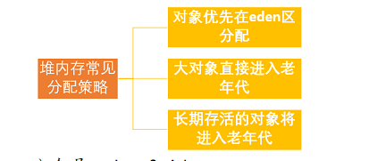

# JVM运行时内存

​		概念： java堆从GC的角度还可以细分为：新生代（Eden 区，from Survivor区 和To Survivor 区）和老年代

## 新生代

​		是用来存放新生的对象，一般占据堆的1/3空间，由于频繁创建对象，所以新生代会频繁触发MinorGC进行垃圾回收，新生代又分为Eden区，ServivorFrom区  ，ServivorTo三个区

- ​	Eden区

​		java新对象的出生地（如果新创建的对象占用内存很大，直接分配到老年代），当Eden区存不够的时候就会触发MinorGC，对新生代区进行一次垃圾回收

-   ServivorFrom

   上一次GC的幸存者，作为这一次的GC的被扫描者。

- ServivorTo

  保留了一次MinorGC过程的幸存者

​	`MinorGC采用复制算法   MinorGC复制算法的过程演示`

1.  Eden，ServivorFrom  复制到ServivorTo ，年龄+1

    首先，把Eden和Servivor区域中存活的对象	复制到ServivorTo区域，（如果有对象的年龄以及达到了老年的标准，则赋值到老年代区），同时把这些对象的年龄+1（如果Servivor to不够位置就放到老年区）

2. ​	清空eden,ServivorFrom区

   ​	然后，清空Eden和ServivorFrom中的对象

3. ServivorTo 和ServivorFrom 互换

   最后，ServivorTo和ServivorFrom 互换，原ServivorTo成为下一次GC时的ServivorFrom 区

   

## 老年代

​		主要存放应用程序中生命周期长的内存对象

​		老年代的对象比较稳定，所以MajorGC不会频繁执行，在进行MajorGC前都先进行了一次MinorGc，使得有新生代的对象晋升入老年代，导致空间不够用时才触发，当无法找到足够的连续空间分配给新创建的较大对象时也会提前触发一次MajorGC进行回收腾出空间（当老年代空间不足的时候就会触发MajorGC进行垃圾回收）

`MajorGC采用标记清除算法`

首先扫描一次所以的老年代，标记处存活的UI小，然后回收没有标记的对象，MajorGC的耗时比较长，因为要扫描再回收，MajorGC会产生内存碎片，为了减少内存损耗，我们一般需要进行合并或者标记出来方便下次直接分配，当老年代也满了装不下了的时候，就会抛出OOM异常  也就是OutOfMemoryError

## 永久代

​		指内存的永久保存区域，主要存放Class和Meta（元数据）的信息，Class在被加载的时候被放入永久区域，它和存放实例的区域不同，GC不会在主程序运行期对永久区域进行清理，所以这也导致了永久代的区域会随着加载的Class的增多而涨满，最终抛出OOM异常

#  垃圾回收算法

## 对象已经死亡？

​	堆中几乎放着所有的对象实例，对堆垃圾回收前的第一步就是要判断哪些对象已经死亡（既不能再被任何途径使用的对象）

### 	引用计数法

​			概念：给对象添加一个引用计数器，每当有一个地方引用它，计数器就加1，当引用失效，计数器就减1，任何时候计数器为0的对象就是不可能再被使用的

​			缺点： 很难解决对象之间相互循环引用的问题  举例A对象引用了B  B对象引用了A 导致它们的引用计数器都不为0，于是引用计数算法无法通知GC回收器回收他们

### 	可达性分析 

​			这个算法的基本思想就是通过一系列的称为“GC Roots”的对象作为起点，从这些节点开始向下搜索，节点所走过的路径称为引用链，当一个对象到GC Roots没有任何引用链相连的话，则证明此对象是不可用的

## 再谈引用

​		

​		无论是通过引用计数法判断对象引用数量，还是通过可达性分析法判断对象的引用链是否可达，判断对象的存活都与“引用”有关

​		jdk1.2以后，java对引用的概念进行扩充，将引用分为强引用，软引用，弱引用，虚引用

### 	强引用 

 			把一个对象赋给一个引用变量，这个引用变量就是一个强引用，当一个对象被强引用变量引用时，它处于可达状态，不可能被垃圾回收机制回收的，即时该对象以后都不会用到jvm也不会回收	，因此强引用是造成java内存泄漏的主要原因至一					

### 	软引用

​			软引用需要SoftReference类来实现，对于只有软引用的对象来说，当系统内存足够时它不会被回收，当系统内存空间不足它会被回收，软引用通常用在对内存敏感的程序中

### 	弱引用

​			弱引用需要用WeakReference类来实现，它比软引用的生存期更短，对于只有弱引用的对象来说，只要垃圾回收机制一运行，不管jvm的内存空间是否足够，总会回收该对象占用的内存

### 	虚引用

​		虚引用需要PhantomReference类来实现，它不能单独使用，必须和引用队列联合使用，虚引用的主要作用是跟踪对象被垃圾回收的状态

## 标记-清除算法

​		该算法分为“标记”和“清除”阶段，首先比较出所有需要回收的对象，在标记完成后统一回收掉所有被标记的对象，它是最基础的收集算法， 这种垃圾收集算法会带来两个明显的问题：

​	1：效率问题

​	2：空间问题（标记清除后会产生大量不连续的碎片）

## 	复制算法

​		为了解决效率问题，“复制”收集算法出现了，它可以将内存分为大小相同的两块，每次使用其中的一块，当这一块的内存使用完后，就将存活的对象复制到另一块去，然后再把使用的空间一次性清理掉，这样就使每次的内存回收都是对内存的一半进行回收

## 标记-整理算法

​		根据老年代的特点提出一种标记算法，标记过程任然与“标记-清除”算法一样，但后续步骤不是直接对可回收对象回收，而是让所有存活的对象向一端移动，然后直接清理掉端边界以外的内存

## 分代收集算法

​		当前虚拟机的垃圾收集都采用分代收集算法，这种算法没有什么新的思想，只是根据对象存活周期不同将内存分为几块，一般讲java对分为新生代和老年代，这样我们就可以根据各个年代的特点选择合适的垃圾收集算法

​      比如在新生代中，每次收集都会有大量对象死去，所以可以选择复制算法，只需要付出少量对象的复制成本就可以完成每次垃圾收集，而老年代的对象存活率是比较高的，而且没有额外的空间对它进行分配担保，所以我们选择标记-清除，或标记-整理算法进行垃圾收集

# 垃圾收集器

# 类的生命周期

​		一个类的完整生命周期如下

## 类的加载过程

Class文件需要加载到虚拟机中之后才能运行和使用，那么虚拟机是如何加载这些Class文件呢？

​	系统加载Class类型的文件主要三步：加载->连接->初始化   连接过程有可分为三步：验证->准备->解析

### 加载

​		类加载过程的第一步，主要完成下面3件事情：

​	 1.通过全类名获取定义此类的二进制字节流

​	 2.将字节流所代表的静态存储结构转换为方法区的运行时数据结构

​	 3.在内存中生成一个代表该类的Class对象，作为方法区这些数据的访问入口

### 验证

### 准备

   准备阶段是正式为类变量分配内存并设置类变量初始值的阶段，这些内存都将在方法区中分配，

### 解析

​		解析阶段是虚拟机将常量池内的符合引用替换为直接引用的过程，解析动作主要针对类或接口，字段，类方法，接口方法，方法类型，方法句柄和调用限定符7类符号引用进行。

### 初始化

​		初始化是类加载的最后一步，也是真正执行类中定义java程序代码（字节码），初始化阶段是执行类构造器方法的过程

### 卸载

  卸载类即该类的Class对象被GC

​	卸载类需要满足3个要求

​	1：该类的所有实例对象都已被GC，也就是说堆不存在该类的实例对象

​	2：该类没有在其他任何地方被引用

​	3：该类的类加载器的实例已被GC

