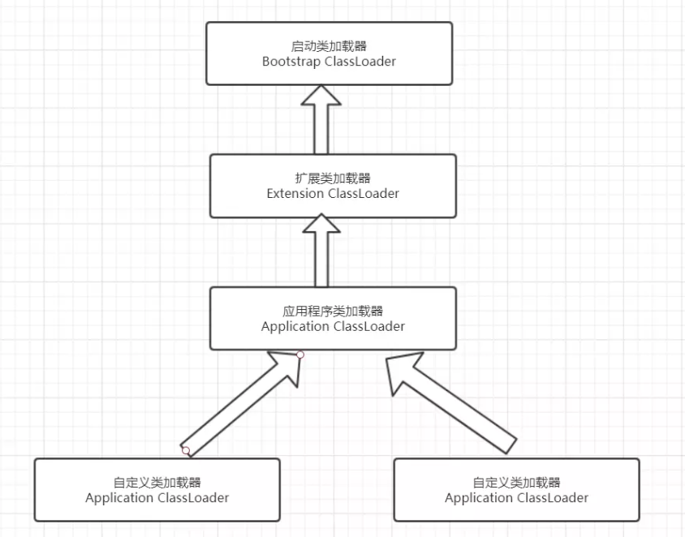

题目来源和解析

https://blog.csdn.net/qq_41701956/article/details/100074023


### 1.什么情况下会发生栈内存溢出。(必背)

(自己回答)

​    堆中 方法区  常量池 程序计数器 方法栈	虚拟机栈

​    在参数  在修改参数的情况，栈的深度无法进行生成 会抛出oom异常


​		未申请题目类型  这个问的是栈内存溢出   而不是jvm所以的栈溢出情况     回答也正确

------

（参考资料）解答：

​	思路：描述栈定义，再描述为什么会溢出，再说明一下相关配置参数，ok的话可以给面试官手写一个栈溢出的demo

- ​	栈是线程私有的，他的生命周期与线程相同，每个方法在执行的时候都会创建一个栈帧，用来存储局部变量表，操作树栈，动态链接，方法出口等信息，局部变量表又包含基本数据类型，对象引用类型

- 若java虚拟机栈的内存大小不允许动态扩展，那么当线程请求栈的深度超过当前java虚拟机栈的最大深度的时候，就抛出StackOvenFlowError

- 若java虚拟机栈的内存大小允许动态扩展，且当线程请求栈时内存用完了，无法动态扩展了，此时抛出OutOfMemoryError错误

- 参数 -Xss 去调整JVM栈的大小

- 简单的栈溢出demo

  ```java
  public class StackOverFlowTest {
      public static void main(String[] args) {
          test();
      }
      public static void test(){
          test();
      }
  }
  ```

  


### 2.详解JVM内存模型(必背)

​	

​	堆内存   分为新生代 和老年代    新生代还可以进行细分为  Eden   SurvivorFrom 空间  Survivorto空间     


（参考资料）解答：

​	**思路：** 给面试官画一下JVM内存模型图，并描述每个模块的定义，作用，以及可能会存在的问题，如栈溢出等。


程序计算器（PC寄存器）： 当前线程所执行的字节码行号指示器，用于记录正在执行的虚拟机字节码指令地址，线程私有

java虚拟机栈： 存放基本数据类型，对象引用，方法出口等信息，线程私有

Native方法栈:  和虚拟机相似，只不过它服务于Native方法，线程私有

java堆（堆内存）：是jvm所管理最大一块内存区域，所以对象实例，数组都存放在java堆上，GC回收的地方，线程共享

方法区: 存放已被加载的类信息，常量，静态变量，即时编译器编译后的代码数据等（即永久代），回收目标主要是常量池的回收和类型的卸载，各线程共享

### 3.JVM内存为什么要分成新生代，老年代，持久代。新生代中为什么要分为Eden和Survivor。

自己解答：（组织语言能力太差 ）

这个要从垃圾回收角度来讲：

​	新生代主要的特点是：新增对象快，垃圾回收频繁  采用的是复制算法

​	老年代主要的特点是: 对象存活年限长，垃圾回收周期比较长，一般是是内存不足的时候才触发老年的垃圾回收机制  采用的是标记回收算法 或者标记整理算法

持久代：主要是存放class文件

因为新生代的垃圾回收频繁  所以hostsprt虚拟机采用的是复制算法，复制算法有一个特点，

分为Eden 和survivor from  和survivor to  它们的比例为8:1:1  

​	首先Eden 空间 它的新增对象快  然后经过minorGc回收  如果Eden空间还存活着引用值，就会年龄+1，存放到Survivor 空间  并且survivor to 清空  

思路： 先讲一下java堆，新生代的划分，再谈谈它们之间的转化，相互之间一些参数的配置（如 -xx:NewRatio,-XXSurvivorRation等），再解释为什么要这样划分，最好加一点自己的理解

1)  内存划分

​	java堆=新生代+老年代

​	新生代=Eden空间+S0+S1

2）一些参数的配置

​	默认的，新生代（young）与老年代（Old）的比例的值为1:2  可以通过参数 -XX：newRatio 配置

​	默认的：Edem：from :to  的比例是8:1:1 

3）为什么要分为Eden和Survivor?为什么要设置两个Survivor区？

 如果没有Survivor，Eden区每进行一次MinorGC，存活的对象就会被送到老年代，老年代很快被填满，触发MajorGC ,老年代的内存空间远大于新生代，进行一次full GC消耗的时间比Minor GC长的多（10倍），所以需要分为Eden和Survivor


### 4.JVM中一次完整的GC流程是怎样的，对象如何晋升到老年代

​		一次完整的GC流程是 MinorGc+FullGC  分别是新生代垃圾回收和老年代垃圾回收

​		思路：先描述一下java堆的区分，再解释MinorGC，MajorGc ，fullGC,描述它们之间转化流程，

​	 java堆=新生代+老年代

​	新生代=Eden+survivorFrom +Survivorto

​	当Eden空间满了的时候，java虚拟机会触发一次minorGc，以收集新生代的垃圾，存活下来的对象，则会转移到Survivor区

​	大对象（需要打量连续内存空间的java对象，如那种很长的字符串），直接进入到老年代

​	如果对象在Eden出生，并经过第一次MinorGc后仍然存活，并且被survivor容纳的话，年龄设为1，每经过一次minorGc，它的年龄会加1，直到年龄超过一定限制（默认为15），则被晋升到老年代，则长期存活的对象进入老年代

老年代满了而无法容纳更多的对象，MinorGc之后通常会进行full Gc清理整个内存堆，包括年轻代和老年代，

Major GC 发生在老年代的GC，清理老年代，经常会伴随至少一次minorGC，比minorGc慢十倍以上


### 5.你知道哪几种垃圾收集器，各自的优缺点，重点讲下cms和G1，包括原理，流程，优缺点。


### 6.JVM内存模型的相关知识了解多少，比如重排序，内存屏障，happen-before，主内存，工作内存。


### 7.简单说说你了解的类加载器，可以打破双亲委派么，怎么打破。

思路： 先说明一下什么是类加载器，可以给面试官画个图，再说一下类的加载器存在的意义，说一下双亲委派模型，最后陈述怎么打破双亲委派模型

答案：

1）	什么是类加载器？

​	类加载器：就是根据指定全限定名称将Class文件加载到jvm内存，转为class对象

​	启动类加载器（Bootstrap Classloader）：由C++语言实现（针对HotSpot），负责将存放<JAVA_HOME>/lib目录或Xbootclasspath参数指定的路径中的类加载到内存中

其他类加载器： 由java语言实现，继承自抽象类ClassLoader，如

​	扩展类加载器（Extension Classloader） 负责加载java_hom\lib\ext目录java.ext.dirs系统变量指定的路径中的所有类库

​	应用程序类加载器（Application Classloader）负责加载用户类路径（classpath）上指定类库，我们可以直接使用这个类的加载器，一般情况，如果我们没有自定义加载器默认就是用这个加载器

2）双亲委派模型

​	双亲委派模型工作过程是:

​		如果一个类加载器收到类的加载的请求，它首先不会自己去尝试加载这个类，而使把这个请求委派给父类加载器完成，每个类加载器都是如此，只有当父加载器在自己的搜索范围内找不到指定的类时，即（ClassNotFoundException），子加载器才会尝试自己去加载



3）为什么需要双亲委派模型？

   在这里，先想一下，如果没有双亲委派，那么用户是不是可以自己定义一个java.lang.Object的同名类，java.lang.String的同名类，并把 它放到Classpath中，那么类之间的比较结果及类的唯一性将无法保证，因此，为什么需要双亲委派模型？**防止内存中出现多份同样的字节码**


4） 怎么打破双亲委派模型

​		打破双亲委派机制则不仅要继续Classloader，还要重写loadclasss和findClass方法

### 8.说说你知道的几种主要的JVM参数


### 9.怎么打出线程栈信息。

思路： 可以说一下jps，top ，jstack这几个命令，再配合一次排查线上问题进行解答。

我的答案：

输入jps，获得进程号。
top -Hp pid 获取本进程中所有线程的CPU耗时性能
jstack pid命令查看当前java进程的堆栈状态
或者 jstack -l > /tmp/output.txt 把堆栈信息打到一个txt文件。
可以使用fastthread 堆栈定位，fastthread.io/


### 10.强引用、软引用、弱引用、虚引用的区别？

   强引用：主要是java中常用的引用，类似于new Object()的引用  这类为强引用  ，不容易被回收

​	软引用:  主要特点是，当堆内存不足的时候，才会进行回收 

​	弱引用：主要特点是  不管堆内存足够不足够，只要进行了解回收就会被回收掉

​	虚引用:  主要特点是  一闪而过，一般这类引用只作为跟踪对象被垃圾回收器回收的活动

**思路：** 先说一下四种引用的定义，可以结合代码讲一下，也可以扩展谈到ThreadLocalMap里弱引用用处。

-  强引用

  我们平时new了一个对象就是强引用，例如Object obj=new Object();即时在内存不足的情况下，jvm宁愿抛出OutOfMemoryError也不会回收这种对象

- 软引用

    如果一个对象只具有软引用，则内存空间足够，垃圾回收器就不会回收它，如果内存空间不足，就会回收这些对象的内存

- 弱引用

   具有弱引用的对象拥有更短暂的生命周期，在垃圾回收器线程扫描它所管辖的内存区域过程中，一旦发现了只具有弱引用的对象，不管当前内存空间是否足够，都会回收它的内存

- 虚引用   如果一个对象持有虚引用，那么它就和没有任何引用一样，在任何时候都可能被垃圾回收器回收，虚引用主要用来跟踪对象被垃圾回收器回收的活动

  


https://www.cnblogs.com/JesseP/p/11750847.html