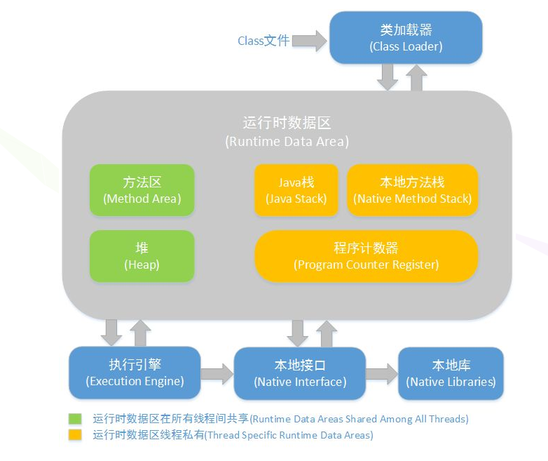

# 1:jvm内存结构

​		线程共享： 堆内存，方法区

​		线程不共享：程序计数器，虚拟机栈，本地方法栈

​		java堆：是java虚拟机所管理的内存中最大的一块，java堆是被所有线程共享的一块内存区域，在虚拟机启动时创建，此内存区域的唯一目的就是存放对象实例，几乎所有的对象实例都在这里分配内存（存放对象实例）

​	方法区： 方法区与方法堆一样，是各个线程共享的内存区域，它用于存储已被虚拟机加载的类信息，常量，静态变量，即时编译器编译后的代码等数据

​	程序计算器: 程序计算器是一块较小的内存空间，可以看作是当前线程所执行的字节码的行号指示器，字节码解释器工作时通过改变这个计算器的值来选取下一条需要执行的字节码指令，分支，循环，跳转，异常处理，线程恢复等功能都需要依赖这个计数器来完成

​					另外，为了线程切换后能恢复到正确的执行位置，每条线程都需要有一个独立的程序计数器，各线程之间计数器互不影响，独立存储，我们称这类内存区域为“线程私有”的内存

​	java虚拟机栈会出现两种错误：

​		StackOverFlowError: 若java虚拟机的内存不允许动态扩展，那么当线程请求栈的深度超过当前java虚拟机栈的最大深度的时候，就会抛出StackOverFlowError错误

​		OutOfMemoryError: 若java虚拟机栈的内存大小允许动态扩展，且当线程请求栈时内存用完了，无法动态扩展了，此时抛出OutOfMemoryError错误

java虚拟机栈也是线程私有的，每个线程都有各自的java虚拟机栈，而且随着线程的创建而创建，随着线程的死亡而死亡

本地方法栈：和虚拟机栈所发挥的作用非常相似，区别是：虚拟机栈为虚拟机执行java程序，本地方法栈则为虚拟机使用到Native方法服务，用于存放本地的局部变量表，操作数栈，动态链接，出口信息等

