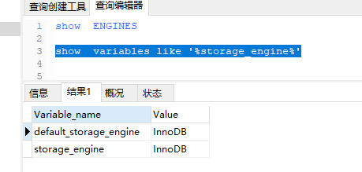
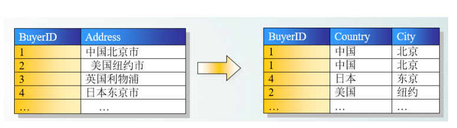
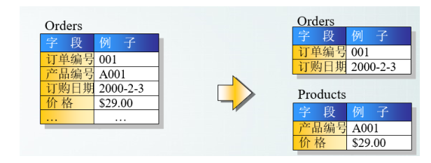
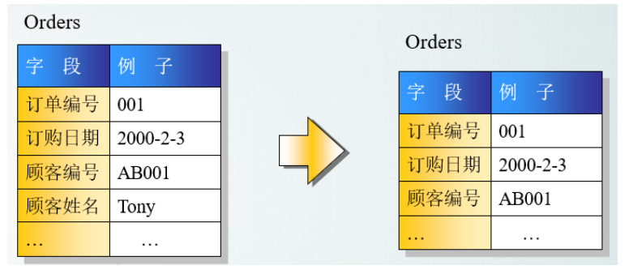
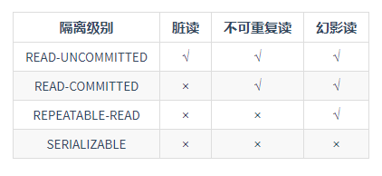

# mysql

## 什么是mysql？

​	mysql是一种关系型数据库

#  存储引擎

## 	存储引擎概念

​		数据库存储引擎是数据库底层软件组织，数据库管理系统（DBMS）使用数据库引擎进行创建，查询，更新和删除数据，不同的存储引擎提供不同的存储机制，索引技巧，锁定水平等功能，使用不同的存储引擎，还可以获得特定的功能，现在许多不同的数据库管理系统都支持不同的数据引擎，存储引擎主要有： 1.MyLsam, 2InnoDB,3.Memory,4.Archive,5.Federated

### MyISAM  和InnoDB区别

​		myisam 是mysql的默认数据库引擎（5.5版之前），虽然性能极佳，而且提供了大量的特性，包括全文索引，压缩，空间函数等，但Myisam不支持事务和行级锁，而且最大缺陷就是崩溃后无法安全恢复，不过5.5版本之后，mysql引入了InnoDB（事务性数据库引擎），mysql5.5版本之后默认存储引擎为InnoDB

大多数的时候我们使用的都是InnoDB存储引擎，但是在某些情况下使用Myisam也是合适的比如读密集的情况下（如果你不介意MyISAM崩溃恢复问题的话）

两者的对比：

​		1：是否支持行级锁： MyISAM只有表级锁（table-level locking）,而InnoDB支持行级锁（row-level locking）和表级锁，默认为行级锁

​		2：是否支持事务和崩溃后的安全恢复： MyISAM强调的是性能，每次查询具有原子性，其执行速度比InnoDB类型更快，但是不支持事务支持，但是InnoDB提供事务支持事务，外部键等高级数据库功能，具有事务（commit）回滚（rollback）和崩溃修复能力的事务安全型表

​	3： 是否支持外键：myISAM 不支持，而InnoDB支持

​	4：是否支持MVCC: 仅InnDB支持，应对高并发事务，MVCC比单纯的加锁更高效，MVCC只在READ_COMMITED和repeatable_read 两个隔离级别下工作，MVCC可以使用，乐观锁和悲观锁来实现，各数据库中mvcc实现并不统一

https://www.cnblogs.com/Luke-Me/p/8990346.html

# mysql之索引

### 	索引是什么？

​		比如我们要在字典中找某一字，如何才能快速找到呢？那就是通过字典的目录

​		对数据库来说，索引的作用就是给“数据”加目录

### 	索引算法

​		设有N条随机记录，不用索引，平均查找N/2次，那么用的索引之后呢?

​			tree(二叉树)索引  log2N

​			hash(哈希)索引  1

​			优点：加快了查询的速度

​			缺点：降低了增删改的速度（update/delete/insert）

​				       增加了表的文件大小（索引文件甚至可能比数据文件还大）

​			

​		索引的使用原则

​				不得不使用索引：

​				索引条件列（where后面最频繁的条件比较适宜索引）

​				索引散列值，过于集中的值不要索引（例如：给性别列'男'，‘女’加索引，意义不大）

​	

### 	索引类型

​		1.普通索引 : 仅仅是加快了查询速度

​		2.唯一索引：行上的值不能重复

​		3：主键索引： 不能重复

​		主键索引和唯一索引的区别： 主键比唯一，但是唯一索引不一定是主键；

​		一张表只能有一个主键，但是可以有多个唯一索引

​		4：全文索引

# mysql之视图

### 	视图的概念

​				视图是从一个或几个基本表（或者视图）导出的表，它与基本表不同，是一个虚表

数据库只存放视图的定义（相当于select语句）,而不存放视图对应的数据，这些数据仍存放在原来的基本表中，所以基本表中的数据发生变化，从视图中查询出的数据也就随之改变了

​	视图一经定义，就可以和基本表一样被查询，被删除，也可以在一个视图之上再定义新的视图，但对视图的更新（增删改）操作则有一定的限制

​		通俗的讲：视图就是一条select语句执行后返回的结果集，所以我们在视图的时候，主要的工作就落在创建这条sql查询语句上   是一张虚表，查询语句执行的结果，不存储具体的数据（基本数据发生了改变，视图也会跟着改变）

### 视图的优点

​			相当于基本表有以下优点

​		1.视图能够简化用户的操作

​			视图机制用户可以将注意力集中在所关心的数据上，如果这些数据不是直接来自基本表，则可以通过定义视图，使数据库看起来结构简单，清晰，并且可以简化用户的数据查询操作

  2. 视图是用户能以不同的角度看待同样的数据

     对于固定的一些基本表，我们可以给不同的用户建立不同的视图，这样不同的用户就可以看到自己需要的信息了

     

# 数据库之三范式

### 第一范式

​		第一范式的目标是确保每列的原子性：如果每列都是不可再分的最小数据单元（也称为最小的原子单元）,则满足第一范式

### 第二范式

​	第二范式要求每个表只描述一件事情

​		

### 第三范式

​		满足第二范式，并且表中的列不存在对非主键列的专递依赖，除了主键订单编号外，顾客姓名依赖于非主键顾客编号

# 数据库之事务

### 	什么是事务?

​		事务是逻辑上的一组操作，要么都执行，要么都不执行。

​		事务最经典也经常被拿出来说例子就是转账了。假如小明要给小红转账1000元，这个转账会涉及到两个关键操作就是：将小明的余额减少1000元，将小红的余额增加1000元。万一在这两个操作之间突然出现错误比如银行系统崩溃，导致小明余额减少而小红的余额没有增加，这样就不对了。事务就是保证这两个关键操作要么都成功，要么都要失败。

### 事务的四大特性（ACID）

1.原子性（Atomicity）： 事务是最小的执行单位，不允许分割，事务的原子性确保动作要么全部完成（commit），要么完全不起作用（rollback）

2.一致性（Consistency）：执行事务前后，数据保持一致，多个事务对同一个数据读取的结果是相同的

3.隔离型（lsolation）: 并发访问数据库时，一个用户的事务不被其它事务所干扰，各并发事务之间数据库时独立的

4.持久性（Durability）：一个事务被提交之后，它对数据库中数据的改变时持久的，即使数据库发生故障也不应该对其有任何影响

### 并发事务带来哪些问题

https://baijiahao.baidu.com/s?id=1611918898724887602&wfr=spider&for=pc

   在典型的应用程序中，多个事务并发运行，经常会操作相同的数据来完成各自的任务（多个用户对同一数据进行操作），并发虽然是必须的，但可能会导致以下的问题

 脏读（dirty read）: 当一个事务正在访问数据并且对数据进行修改，而这种修改还没有提交到数据中，这时另外一个事务也访问了这个数据，然后使用了这个数据，因为这个数据还没有提交的数据，那么另外一个事务读到的这个数据时“脏数据” 依据“脏数据”所做的操作可能是不正确的

可重复读: 指在一个事务读取一个数据时，另外一个事务也访问了该数据，那么在第一个事务中修改了这个数据后，第二个事务也修改了这个数据，这样第一个事务的修改结果被丢失，因此成为丢失修改，例如，事务1读取某个表中的数据A=20 ，事务2也读取了A=20 ，事务1修改A=A-1，事务2也修改A=A-1，最终结果A=19,事务1修改被丢失

不可重复读： 指在一个事务内多次读同一数据，在这个事务还没有结束时，另一个事务也访问该数据，那么，在第一个事务中的两次读取数据之间，由于第二事务的修改导致第一个事务两次读取的数据可能不太一样，这就发生了在一个事务内两次读到的数据是不一样的情况，因此成为不可重复读

幻读： 幻读与不可重复读类似，它发生在一个事务（T1）读取了几行数据，接着另一个并发事务（T2）插入了一些数据时，在随后的查询中，第一个事务（T1）就会发现多了一些原本不存在的记录，就好像发生了幻觉一样，称之为幻读

不可重复读和幻读区别： 

​	不可重复读的重点是修改比如多次读取一条记录发现其中某些列的值被修改，幻读的重点在于新增或者删除比如多次读取一条记录发现记录增多或减少了

# 事务的隔离级别

​		SQL标准定义了四个隔离级别：

​		读取未提交（read_uncommitted）:最低的隔离级别，允许读取尚未提交的数据变更，可能会导致脏读，幻读或不可重复读。

​		读取已提交（read-committed）：允许读取并发事务已经提交的数据，可以阻止脏读，但是幻读或不可重复读仍有可能发生。

​		可重复读（repeatable-read）：对同一字段的多次读取结果都是一致的，除非数据时本身事务自己所修改，可以阻止脏读和不可重复读，但是幻读仍有可能发生

​		可串行化（SERIALIZABLE）： 最高的隔离级别,完全服从ACID的隔离级别，所以的事务依次逐个执行，这样事务之间就完全不可能产生干扰，也就是说，该级别可以防止脏读，不可重复读以及幻读

# 锁机制与InnoDB锁算法

​	MyIsam采用的表级锁（table-level-locking）

​	InnoDB支持表级锁和行级锁，默认为行级锁

​	表级锁和行级锁对比：

​		表级锁： mysql中锁定粒度最大的一种锁，对当前操作的整张表加锁，实现简单，资源消耗也比较少 ，加锁快，不会出现死锁，其锁定粒度最大，触发锁冲突的概率最高，并发率最低，MyIsam和InnoDB引擎都支持表级锁。

​		行级锁：mysql锁定粒度最小的一种锁，只针对当前操作的行就行加锁，行级锁能大大减少数据库操作的冲突，其加锁粒度最小，并发率高，但加锁的开销也最大，加锁慢，会出现死锁

# 大表优化

当mysql单表记录数过大时，数据库的crud性能会明细下降，一些常见的优化措施如下：

​	1.限定数据的范围

​		务必禁止不带任何限制数据范围条件的查询语句，比如当用户在查询订单历史的时候，我们可以控制在一个月的范围内；

​	2.读/写分离

​		经典的数据库拆分方案，主库负责写，从库负责读

​	3.垂直分区

​		根据数据库里面数据表的相关性进行拆分，例如，用户表即有用户登录信息，又有用户的基本信息，可以将用户拆分两个单独的表，甚至放到单独的库做分库。

 	4.水平分区

​			保持数据表结构不变，通过某种策略存储数据分片，这样每一片分散到不同的表或者库中，达到分布式的目的，水平拆分可以支撑非常大的数据量

​	