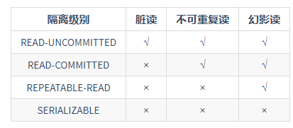

https://article.itxueyuan.com/eoJEMj

**1. 什么是索引?**

  索引是一种数据结构，可以帮助我们快速的进行数据查找

**2. 索引是个什么样的数据结构呢?**

​	索引的数据结构和具体存储引擎的实现有关，在mysql中使用较多的索引有hash索引，B+树索引等，而我们经常使用的Innodb存储引擎是B+tree索引

**3. Hash索引和B+树所有有什么区别或者说优劣呢?**

  首先要知道Hash索引和B+tree树索引的底层原理

​	Hash索引底层就是Hash表，进行查找，调用一次hash函数就可以获取相应的键值，之后进行回表查询获得实际数据，

​	B+树底层实现是多路平衡查找树，对于每一次的查询都是从根节点出发，查找到叶子节点方可以获得所查键值，然后根据查询判断是否需要回表查询数据

那么就可以看出他们有以下的不同：

- ​		hash索引进行等值查询更快（一般情况下）但是无法进行范围查询

​		因为在hash索引中经过hash函数建立索引之后，索引的顺序与原顺序无法保持一致，不能支持范围查询，而b+树的所有节点都遵循（左节点小于父节点，右节点大于父节点，多叉树也类似）天然支持范围

- ​	hash索引不支持使用索引进行排序，原理同上

- ​	hash索引不支持模糊查询以及多列索引的最左前缀匹配，原理也是因为hash函数不可预测，AAAA和AAAB的索引没有相关性

- ​	hash索引任何时候都避免不了回表查询数据，而B+tree在符号某些条件（聚簇索引,覆盖索引等）的时候可以只通过索引完成查询

​		hash索引 存取文件的方式是  索引是一个文件(索引)  数据时一个文件 （data）

​		B+tree（聚簇索引  ）索引是一个文件  索引+data

- hash索引虽然在等值上查询比较快，但是不稳定，性能不可预测，当某个键值存在大量重复的时候，发生hash碰撞，此时效率可能极差，而B+树的查询效率比较稳定，对于所有的查询都是从根节点到叶子节点，且树的高度较低

因此，在大多数情况下，直接选择B+树索引可以获得稳定且较好的查询速度，而不需要使用hash索引

**4. 上面提到了B+树在满足聚簇索引和覆盖索引的时候不需要回表查询数据,什么是聚簇索引?**

在B+树的索引中，叶子节点可能存储了当前的key值，也可能存储了当前的key值以及整行的数据，这就是聚簇索引和非聚簇索引，*在Innodb中，只有主键索引是聚簇索引，如果没有主键，则挑选一个唯一键建立聚簇索引，如果没有唯一键，则隐射的生成一个键来建立聚簇索引*

当查询使用聚簇索引时，在对应的叶子节点，可以获取到整行数据，因此不用再次进行回表查询

**5. 非聚簇索引一定会回表查询吗?**

​	不一定，这涉及到查询语句所要求的字段是否全部命中了索引，如果全部命中了索引，那么就不必再进行回表查询

​	举个简单的例子，假设我们在员工表的年龄上建立了索引，那么当进行select age from employee where age<20的查询时，在索引的叶子节点上，已经包含了age信息，不会再进行回表查询

**6. 在建立索引的时候,都有哪些需要考虑的因素呢?**

建立索引的时候一般要考虑到字段的使用频率，经常作为条件进行查询的字段比较适合，如果需要建立联合索引的话，还需要考虑联合索引中的顺序，此外也要考虑其他方面比如防止过多的索引对表造成太大的压力，这些都和实际的表结构以及查询有关

**7. 联合索引是什么?为什么需要注意联合索引中的顺序?**

​    mysql可以使用多个字段同时建立一个索引，叫做联合索引，在联合索引中，如果想要命中索引，需要按照建立索引时的字段顺序挨个使用，否则无法命中索引

**8. 创建的索引有没有被使用到?或者说怎么才可以知道这条语句运行很慢的原因?**

  

**9. 那么在哪些情况下会发生针对该列创建了索引但是在查询的时候并没有使用呢?**

## 事务相关

**1. 什么是事务?**

​		事务是作为单个逻辑工作单元的一系列操作，这些操作作为一个整体，一起向系统提交，要么都执行，要么都不执行，事务是不可分割的工作逻辑单元

**2. ACID是什么?可以详细说一下吗?**

原子性（Atomicity）： 事务是一个完整的操作，事务的各步操作是不可分的（原子的）；要么都执行，要么都不执行

一致性（Consistency）：当事务完成时，数据必须处于一致状态（数据库总是从一个一致性的状态转移到另一个一致性的状态，不会存在中间状态）

隔离性（lsonlation）： 对数据进行修改的所有并发事务是彼此隔离的，这标明事务必须是独立的，它不应以任何方式依赖于或影响其他事务

永久性（Durability）： 事务完成后，它对数据库的修改被永久保持，事务日志能够保持事务的永久性

**3. 同时有多个事务在进行会怎么样呢?**

多事务的并发进行一般会造成以下几个问题

 脏读:  A事务读取到了B事务未提交的内容，而B事务后面进行了回滚，那么A事务读取的数据就是脏数据

丢失修改：AB事务同事去修改一个数据  先提交的事务会被覆盖掉

不可重复读：当事务A多次读取同一数据，事务B在事务A多次读取的过程中，对数据作了更新并提交，导致事务A多次读取同一数据时，结果不一致

幻读： 系统管理员A将数据库中所有学生的成绩从具体分数改为ABCDE等级，但是系统管理员B就在这个时候插入了一条具体分数的记录，当系统管理员A改结束后发现还有一条记录没有改过来，就好像发生了幻觉一样，这就叫幻读

**4. 怎么解决这些问题呢?MySQL的事务隔离级别了解吗?**

四大隔离级别，不同的数据库在实现时，产生的并发问题是不同的。

​	**未提交读**  最低的隔离级别，允许读取尚未提交的数据变更，**可能会导致脏读，幻读或不可重复读**

​	**已提交读**   允许读取并发事务已经提交的数据，**可以阻止脏读，但是幻读或不可重复读仍有可能发生**

​	**可重复读** 对同一字段的多次读取结果都是一致的，除非数据时本身事务自己所修改，可**以阻止脏读和不可重复读，但幻读仍有可能发生**

​	**可串行化**：最高的隔离级别，完全服从ACID的隔离级别，所以的事务依次执行，这个事务之间就完全不可能产生干扰，也就是说，**该级别可以防止脏读，不可重复读以及幻读。**

****

**5. Innodb使用的是哪种隔离级别呢?**

mysql  InnDB存储引擎的默认支持隔离级别是**可重复读**（REPEATABLE-READ），我们通过select @@tx_isolation；

**6. 对MySQL的锁了解吗?**

​		Myisam 和InnoDB存储引擎使用的锁

​		Myisam采用表级锁

​		InnoDB支持行级锁，和表级锁，默认为行级锁

**7. MySQL都有哪些锁呢?像上面那样子进行锁定岂不是有点阻碍并发效率了?**

https://zhuanlan.zhihu.com/p/88880235

 ***按锁粒度分类***   行级锁&表级锁&页级锁

​	 **行级锁：**	

​		描述：行级锁是mysql中锁定粒度最细的一种锁，表示只针对当前操作的行进行加锁，行级锁能大大减小数据库操作的冲突，器加锁粒度最小，但加锁的开销也最大，**行级锁分为共享锁和排他锁**

​		特点： 开销大，加锁慢，会出现死锁，发生锁冲突的概率最低，并发度也最高

​	**表级锁：**		

​		描述： 表级锁是mysql中锁定粒度最大的一种锁，表示对当前操作的整张表加锁，它实现简单，资源消耗较小，被大部分mysql引擎支持，最常用使用的Myisam与InnoDB都支持表级锁定，**表级锁定分为 共享都锁（共享锁）与表独占写锁（排他锁）**

​		特点： 开销小，加锁快，不会出现死锁，发生锁冲突的概念最高，并发度也最低

   **页级锁：**

​	   描述：  页级锁是mysql中锁定粒度介于行级锁和表级锁中间的一种锁，表级锁速度快，但冲突多，行级冲突少，但速度慢，因此，采取了折衷的页级锁，一次锁定相邻的一组记录。BDB 支持页级锁

​	特点:  开销和加锁时间界于表锁和行锁之间；会出现死锁；锁定粒度界于表锁和行锁之间，并发度一般

***按锁级别分类***   共享锁  &排他锁&意向锁

​	**共享锁**又称读锁，是读取操作创建的锁，其它用户可以并发读取数据，但任何事务都不能对数据进行修改（获取数据上的排他锁），直到已释放所有共享锁

 

**排他锁**又称写锁、独占锁，如果事务T对数据A加上排他锁后，则其他事务不能再对A加任何类型的封锁。获准排他锁的事务既能读数据，又能修改数据。

**意向锁**是表级锁，其设计目的主要是为了在一个事务中揭示下一行将要被请求锁的类型。InnoDB 中的两个表锁：

意向共享锁（IS）：表示事务准备给数据行加入共享锁，也就是说一个数据行加共享锁前必须先取得该表的IS锁；

意向排他锁（IX）：类似上面，表示事务准备给数据行加入排他锁，说明事务在一个数据行加排他锁前必须先取得该表的IX锁。

意向锁是 InnoDB 自动加的，不需要用户干预。

对于INSERT、UPDATE和DELETE，InnoDB 会自动给涉及的数据加排他锁；对于一般的SELECT语句，InnoDB 不会加任何锁，事务可以通过以下语句显式加共享锁或排他锁

## 表结构设计

**1. 为什么要尽量设定一个主键?**

   主键是数据库确保数据行在整张表唯一性的保障，即使业务上本张表没有主键，也建议添加一个自增长的ID列作为主键，设定主键之后，在后续的删改查的时候可能更加快速以及确保操作数据范围安全

**2. 主键使用自增ID还是UUID?**

推荐使用自增ID,不要使用UUID.

  因为在InnoDB存储引擎中,主键索引是作为聚簇索引存在的,也就是说,主键索引的B+树叶子节点上存储了主键索引以及全部的数据(按照顺序),如果主键索引是自增ID,那么只需要不断向后排列即可,如果是UUID,由于到来的ID与原来的大小不确定,会造成非常多的数据插入,数据移动,然后导致产生很多的内存碎片,进而造成插入性能的下降.

总之,在数据量大一些的情况下,用自增主键性能会好一些.

**3. 字段为什么要求定义为not null?**

null值会占用更多的字节,且会在程序中造成很多与预期不符的情况.

**4. 如果要存储用户的密码散列,应该使用什么字段进行存储?**

密码散列,盐,用户身份证号等固定长度的字符串应该使用char而不是varchar来存储,这样可以节省空间且提高检索效率.

## 存储引擎相关

**1. MySQL支持哪些存储引擎?**

MySQL支持多种存储引擎,比如InnoDB,MyISAM,Memory,Archive等等.在大多数的情况下,直接选择使用InnoDB引擎都是最合适的,InnoDB也是MySQL的默认存储引擎.

*InnoDB和MyISAM有什么区别?*

1. **是否支持行级锁** : MyISAM 只有表级锁(table-level locking)，而InnoDB 支持行级锁(row-level locking)和表级锁,默认为行级锁。
2. **是否支持事务和崩溃后的安全恢复： MyISAM** 强调的是性能，每次查询具有原子性,其执行速度比InnoDB类型更快，但是不提供事务支持。但是**InnoDB** 提供事务支持事务，外部键等高级数据库功能。 具有事务(commit)、回滚(rollback)和崩溃修复能力(crash recovery capabilities)的事务安全(transaction-safe (ACID compliant))型表。
3. **是否支持外键：** MyISAM不支持，而InnoDB支持。
4. **是否支持MVCC** ：仅 InnoDB 支持。应对高并发事务, MVCC比单纯的加锁更高效;MVCC只在 `READ COMMITTED` 和 `REPEATABLE READ` 两个隔离级别下工作;MVCC可以使用 乐观(optimistic)锁 和 悲观(pessimistic)锁来实现;各数据库中MVCC实现并不统一。

## 零散问题

**1. MySQL中的varchar和char有什么区别.**

**2. varchar(10)和int(10)代表什么含义?**

**3. MySQL的binlog有有几种录入格式?分别有什么区别?**

**4. 超大分页怎么处理?**

**5. 关心过业务系统里面的sql耗时吗?统计过慢查询吗?对慢查询都怎么优化过?**

**6. 上面提到横向分表和纵向分表,可以分别举一个适合他们的例子吗?**

**7. 什么是存储过程？有哪些优缺点？**

**8. 说一说三个范式**

**9. MyBatis中的#**