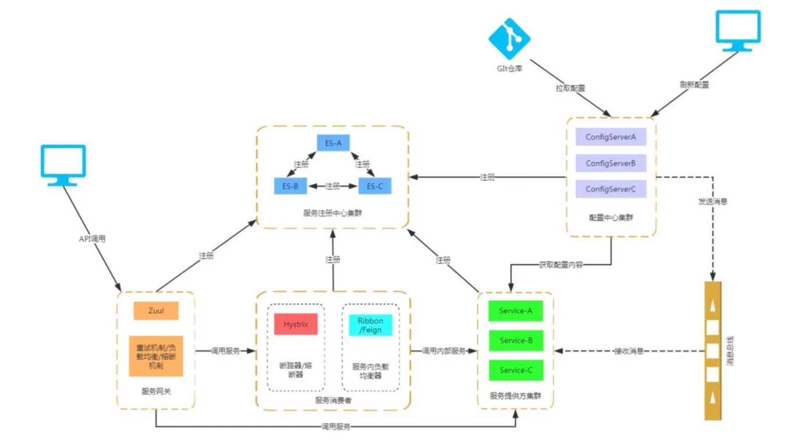
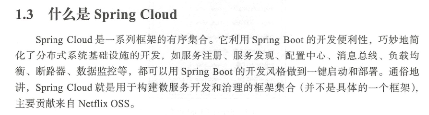

 

**什么是Spring Cloud？**

 微服务是一种架构风格，即将单体应用划分为小型的服务单元，帮助开发人员构建有弹性的，可靠的，协调的应用程序，SpringCloud 构建与spring Boot 之上，使得开发者很容易人手并快速应用于生产中

 **使用微服务架构的优势和劣势？**

  1. 优势

     - 服务的独立部署：每个服务都是一个独立的项目，可以独立部署，不依赖于其他服务，耦合性低

     -  服务的快速启动，拆分之后服务启动的速度必然要比没拆分之前的要块很多，因为依赖的库少了，代码量也少了
     - 更加适合敏捷开发： 敏捷开发以用户的需求进化为核心，采用迭代，循环渐进的方式进行，服务拆分可以快速发布新版本，修改哪个服务只需要发布对应的服务即可，不用整体重新发布
     - 职责专一，由专门的团队负责专门的服务，业务发展迅速时，研发人员也会越来越多，每个团队可以负责对应的业务线，服务的拆分有利于团队之间的分工
     - 服务可以动态按需扩容，当某个服务的访问量较大时，我们只需要将这个服务扩容
     - 代码的复用：每个服务都提供RSET API，所有的基础服务都必须抽出来，很多的底层实现都可以以接口方式提供

  2. 劣势

     - 分布式部署，调用复杂性高，单体应用的时候，所有模块之前的调用都是在本地进行的，在微服务中，每个模块都市独立部署的，通过Http来进行通信，这当中会产生很多问题，比如网络问题，容错问题，调用关系等
     - 独立的数据库，分布式事务的挑战：每个微服务都有自己的数据库，这就是所谓去中心化的数据管理，这样的模式优点在于不同的服务，可以选择适合自身业务的数据，比如订单服务可以用mysql，评论服务可以用MongDB,商品搜索服务可以用Elasticsearch,缺点就是事物的问题了，目前最理想的解决方案就是柔性事物中最终一致性，
     - 测试的难度提升：服务和服务之间通过接口来交互，当接口有改变的时候，对所有的调用方都是有影响的，这个时候自动化测试就非常重要了，如果靠人一个个接口去测试，那工作量就太大了，
     - 运维难度的提升： 在采用传统的单体应用时，我们可能只需要关注一个Tomcat的集群，一个mysql的集群就可以了，但这在微服务架构下是行不通的，当业务增加时，服务也将越来越多，服务的部署，监控将变的非常复杂，这个时候对于运维的要求就高了

​	