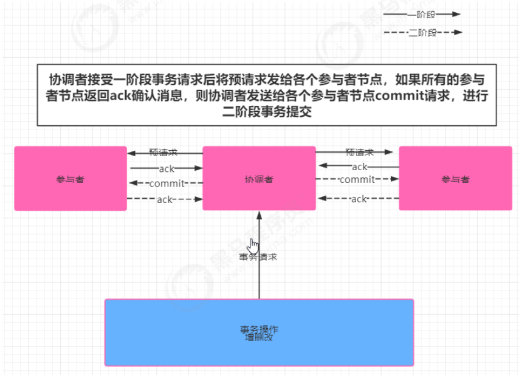

## CAP原则

​		cap在分布式系统中主要指的是一致性（Consistency）、可用性（Availability）、和分区容错性

（Partition tolerance ）

- 一致性   

  一致性指的是强一致性

- 可用性

  系统提供的服务一直处于可用状态，用户的操作请求在指定响应时间内响应请求，超出时间范围，认为系统不可用

- 分区容错性

  分布式系统在遇到任何网络分区故障的时候，仍需要能够保证对外提供一致性和可用性服务，除非是整个网络都发生故障

  

    **在一个分布式系统中不同时满足 强一致性、可用性 、分区容错性，最多满足两个 对于分布式而言，必须保证p  要么满足AP  要么是CP模型**

  

##  一致性协议

​			 事务需要跨多个分布式节点时，为了保证事务的ACID特性，需要选举出一个协调者来协调分布式各个节点的调度，基于这个思想衍生了多种一致性协议；

###    2pc 二阶段提交

​		

- 阶段一  提交事务请求

  1. 协调者向所有的参与者节点发送事务内容，询问是否可以执行事务操作，并等待其他参与者节点的反馈
  2. 各参与者节点反馈给协调者，事务是否可以执行

- 阶段二  事务提交

  1.协调者向各个参与者节点发送commit请求

  2.参与者节点接受commit请求后，执行事务的提交操作

  3.各参与者节点完成事务提交后，向协调者返回提交commit

  4.协调者接受各个参与者节点的ack后，完成事务commit

  中断事务

  1.发送回滚请求

  2.各个参与者节点回滚事务

  3.反馈给协调者事务回滚结果

  4.协调者接受各参与节点ack后回滚事务

  二阶段提交存在的问题： 

  ​	同步阻塞： 所有参与事务操作的节点处于同步阻塞状态，无法进行其他操作

  ​	单点问题： 一旦协调者出现单点故障，无法保证事务的一致性操作

  ​	

### 3PC 三阶段提交

### Paxos算法

### ZAB协议