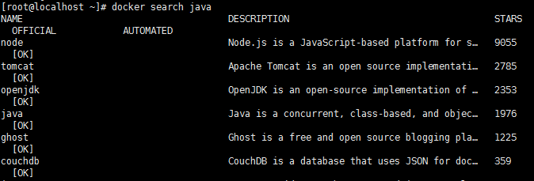
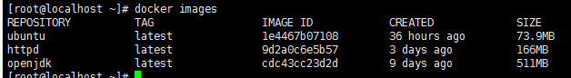
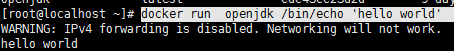

---

---

## docker 镜像常用命令

### 搜索镜像

docker search  命令搜索存放在Docker Hub 中的镜像  例如

docker  search   java



该表格包含5列，含义如下

- name 镜像仓库名称
- description 镜像仓库描述
- stars 镜像仓库收藏数
- official 表示是否为官方仓库
- automated 表示是否是自动构建镜像仓库


### 下载镜像  

​	docker pull  java   <-镜像名称/版本号->

​	docker pull   openjdk/java:8


### 列出镜像

​	使用docker  images 命令即可列出已下载的镜像

​	

该表格包含5列，含义如下

- repository 镜像所属仓库名称
- tag  镜像标签，默认是latest，表示最新
- image Id  镜像id ，表示镜像唯一标识
- created  镜像创建时间
- size 镜像大小


### 删除本地镜像

使用 docker rmi 命令即可删除指定镜像

​	例1 删除指定名称的镜像	

```
docker rmi hello-world
```

​	例2  删除所有镜像

```
docker rmi  -f $(docker images)
```

​	-f 参数表示强制删除


## Docker 容器常用命令

### 新建并启动容器

​		docker  run  命令即可新建并启动一个容器

​		-d 选项  表示后台运行

​		-P 选项  随机端口映射

​		-p 选项 指定端口映射 ，有以下四种格式

​				ip:hostPort:containerPort

​				ip::containerPort

​				hostPort:containerPort

​				containerPort

​		--networt 选项（两个--）：指定网络模式，该选项有以下可选参数：

​			--network=bridge  默认选项，表示连接到默认的网桥

​			--network=host 容器使用宿主机的网络

​			--network=container:NAME_or_ID: 告诉Docker让新建的容器使用已有容器的网络配置

​			--network=none 不配置该容器的网络，用户可自定义网络配置


实例

​	docker run  openjdk /bin/echo 'hello world' 



### 列出容器

 docker ps 命令即可列出运行中的容器