# ThreadLocal原理分析

​	参考 https://www.cnblogs.com/luxiaoxun/p/8744826.html

​	ThreadLocal变量，线程局部变量，同一个ThreadLocal所包含的对象，在不同的Thread(线程）中有不同的副本

## 	ThreadLocal实现原理

​			ThreadLocal是泛型类，可以接受任何类型的对象

​			因为一个线程可以存着多个ThreadLocal对象，所以其实是ThreadLoccal内部维护了一个Map(ThreadLocalMap)

## 	  内存泄漏问题

​		ThreadLocalMap key是软引用   软引用在下次垃圾回收的时候一定会被回收   而value 是强引用      所以导致了null-value的情况

# 线程池

​	池发技术的思想主要是为了减少每次获取资源的消耗，提高对资源的利用率

## 	使用线程池的好处？ 三点

​		**降低资源消耗:**  通过重复利用已创建的线程降低线程创建和销毁造成的消耗

​		**提高响应速度：**当任务到达时，任务可以不需要的等到线程创建就能立即执行

​		**提高线程的可管理性**：线程是稀缺资源，如果无限制的创建，不仅消耗系统资源，还会降低系统的稳定性，使用线程池可以进行统一的分配，调优和监控

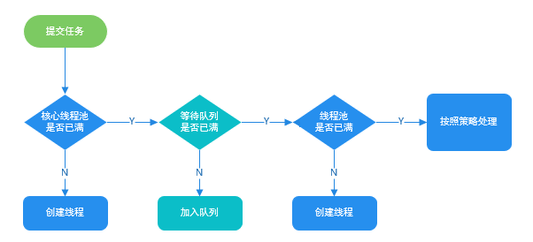

# 反射机制

​		java反射机制是在运行状态中，对于任意一个类，都能够知道这个类的所有属性和方法，对于任意 一个对象，都能够调用它的任意一个方法和属性，这种动态获取的信息以及动态调用对象的方法的功能称为java语言的反射机制

## 三次获取class对象的方式

​		1.class.forName();

​		2.类.class

​		3.变量名.getclass() 方法

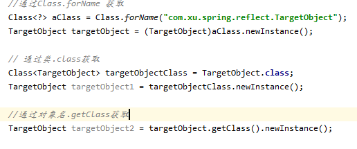

# TCP/IP 结构

​	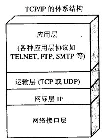

​	

应用层（举例  使用HTTP协议  DNS  SMTP协议）

​	通过应用进层间的交互来完成特点网络应用

运输层（举例  使用tcp协议  udp协议 ）

​		是负责向两台主机进程之间的通信提供通用的数据传输服务

网络层 （举例 IP协议）

​		在计算机网络中进行通信的两个计算机之间可能会经过很多个数据链路，也可能还要经历很多通信子网，网络层的任务就是选择合适的网间路由和交换节点，确保数据及时传送

# TCP 三次握手和四次挥手

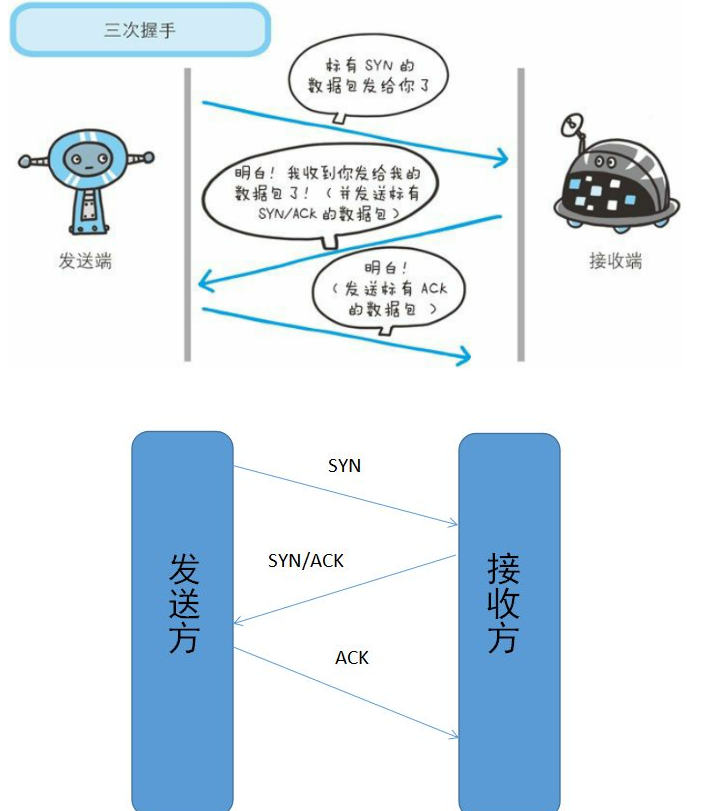

三个步骤 分别是：

​	客户端向服务端发送syn标志的数据包---代表第一次握手 

​		详细点： 第一次握手概括

​					**客户端给服务端发送一个syn的报文，并指明客户端的初始化序列号为ISN，此时客户端处于SYN_Send状态**

​	服务端向客户端发送带有syn并且携带本身的ACK标识的数据包  ----代表第二次握手

​				详细点：第二次握手概括

​					服务端接收到客户端的SYN报文之后，会以客户端的SYN报文作为应答，并且也指定了自己的初始化序列号ISN，同时会把客户端的初始化ISN+1作为ACK的值，表示自己已经收到了客户端的SYN，此时服务器处于SYN_RECEIVED的状态

​	客户端向服务端发送ACK标识数据包  代表第三次握手

​				详细点： 第三次握手概括

​					客户端收到SYN报文之后，会发送一个ACK报文，当然,也是一样把服务器的ISN+1作为ACK的值，表示已经收到了服务器的SYN报文，此时客户端处于establised状态

​		

​	重点   服务器收到ACK报文之后，也处于establised状态，此时，双方才建立起了链接

​	1： syn_send   在发送连接请求后等待匹配的连接请求

​	2： syn_received  在收到和发送一个连接请求后等待请求的确认

​	3：  established  代表一个打开的连接，数据可以传送给用户

## 为什么不要三次握手，两次不行？

​			不行？因为客户端和服务端都需要确认双方  发送正常，接收正常与对方发送正常，接收正常

​				第一次握手 client 什么都不确认，service端确认 client 端发送正常  service接收正常

​				第二次握手  client 确认了 自己发送正常，接收正常，service端  对方发送正常，  自己接收正常

​				第三次握手  client 确认了 自己发送正常，接收正常，对方发送正常，接收正常，service端 自己接收正常，发送正常，对方接收正常  发送正常

​				

​				

# 四次挥手

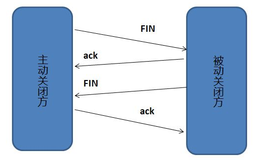

断开一个TCP连接则需要“四次挥手”

​	客户端 发送一个FIN，用来关闭客户端到服务器的数据传送

​	服务器 收到这个FIN，它发回一个ACK,确认序号为收到的序号加1，和SYN一样，一个FIN将占有一个序号

​	服务器 发送一个FIN给客户端,关闭与客户端的连接

​	客户端 发回ACK报文确认，并且将确认序号设置为收到序号加1

详细的概括：

​		刚开始双方都处于establised状态，假如是客户端先发起关闭请求，则：

​		1.第一次挥手，客户端发送一个FIN报文，报文会指定一个序列号，此时客户端处于**CLOSE_WAIT1**状态

​		2.第二次挥手，服务端收到一个FIN之后，会发送一个ACK报文，且把客户端的序列号值+1作为ACK报文的序列号值，表明已经收到客户端的报文了，此时服务端处于**CLOSE_WAIT2**状态

​		3.第三次挥手，如果服务端也想断开连接了，和客户端的第一次挥手一样，发给FIN保护，且指定一个序列号，此时服务端处于**LAST_ACK**的状态

​		4.第四次挥手，客户端收到FIN之后，一样发送一个ACK报文作为应答，且把服务端的序号值+1作为自己ACK报文的序列号值，此时客户端处于TIME_WAIT状态，需要过一阵子以确保服务端收到自己的ACK报文之后才进入**CLOSED**状态

  		5. 服务端收到ACK报文之后，就处于关闭连接了，处于**CLOSED**状态

# TCP 与UDP协议的区别

​		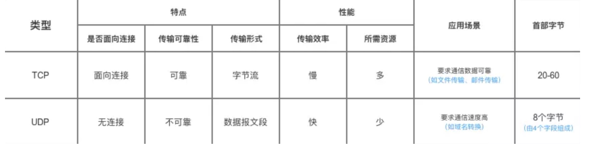

在浏览器中输入url地址 -->显示主页的过程

​	

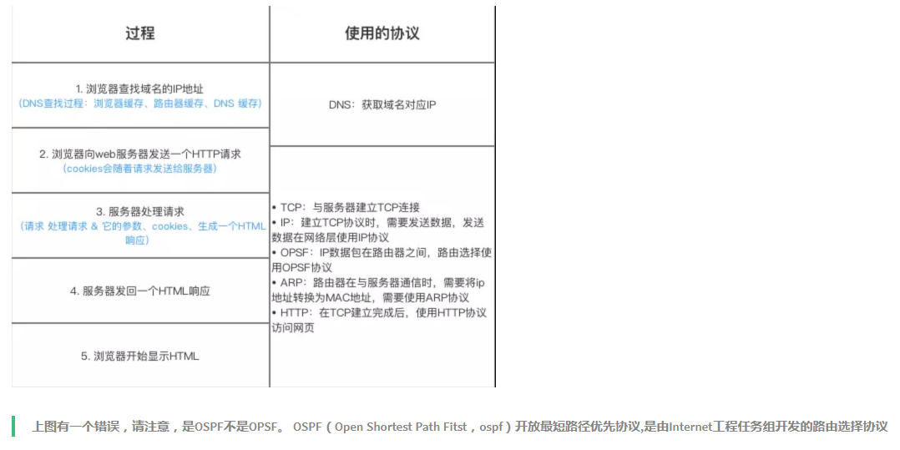

​	总体过程

​		1： DNS去解析网址 等待ip地址

​		2: tcp连接  建立客户端和服务端的一个连接

​		3： 服务器处理请求，并且响应

​		4： 浏览器渲染页面

​		5： 连接结束	

# cookie 和session 

​		cookie： 在网站中，http请求是无状态的   也就是说即时第一次和服务器连接后并且登录成功后，第二次请求服务器依然不知道当前请求的是哪个用户，Cookie的出现就是为了解决这个问题，第一次登录后返回一些数据（cookie）给浏览器，然后浏览器保存在本地，当该用户发送第二次请求的时候，就会自动的把上次请求存储的cookie数据自动携带给服务器，服务器通过浏览器携带的数据就能判断当前用户是哪个了

​		cookie限制： 存储的数据有限，不同的浏览器有不同的存储大小，但一般不超过4kb，因此使用cookie只能存储一些小量的数据，并且cookie不安全

​	session : session和cookie的作用有点类型，都是存储用户相关的信息， 不同的是，cookie是存储在本地浏览器，session是一个思路，一个概念，一个服务器存储授权信息的解决方案，不同的服务器，不同的框架 有不同的实现

​	seesion一般的两种存储方式

​			1：存储在服务端: 通过cookie存储一个seesionid，然后具体的数据则保存在seesion

​			2： 将seesion数据加密，然后存储在cookie中

​	

# HTTP和HTTPS的区别？

​		1：**端口** ：HTTP的URL由“http://”起始且默认使用端口80，而HTTPS的URL由“https://”起始且默认使用端口443。

​		2： **安全性和资源消耗**：  http协议运行在tcp之上，所有的传输的内容都是通过明文，客户端和服务端都无法验证对方的身份，https是运行在SSL和TLS之上的HTTP协议，SSL/TLS的URL运行在TCP之上，所有传输的内容都经过加密，加密采用对称加密，但对称加密的密钥用服务器方的证书进行了非对称加密。所以说，HTTP 安全性没有 HTTPS高，但是 HTTPS 比HTTP耗费更多服务器资源。

- 对称加密：密钥只有一个，加密解密为同一个密码，且加解密速度快，典型的对称加密算法有DES、AES等；
- 非对称加密：密钥成对出现（且根据公钥无法推知私钥，根据私钥也无法推知公钥），加密解密使用不同密钥（公钥加密需要私钥解密，私钥加密需要公钥解密），相对对称加密速度较慢，典型的非对称加密算法有RSA、DSA等。

# BIO  NIO  AIO 总结

​		同步跟异步的区别

​		同步： 	两个同步任务相互依赖，并且一个任务必须以依赖于另一任务的某种方式执行。 比如在`A->B`事件模型中，你需要先完成 A 才能执行B。 再换句话说，同步调用种被调用者未处理完请求之前，调用不返回，调用者会一直等待结果的返回。

​	异步  两个异步的任务完全独立的，一方的执行不需要等待另外一方的执行。再换句话说，异步调用种一调用就返回结果不需要等待结果返回，当结果返回的时候通过回调函数或者其他方式拿着结果再做相关事情，

阻塞跟非阻塞的区别

​	阻塞：   阻塞就是发起一个请求，调用者一直等待请求结果返回，也就是当前线程会被挂起，无法从事其他任务，只有当条件就绪才能继续。

非阻塞： 非阻塞就是发起一个请求，调用者不用一直等着结果返回，可以先去干其他事情。

**如何区分 “同步/异步 ”和 “阻塞/非阻塞” 呢？**

同步/异步是从行为角度描述事物的，而阻塞和非阻塞描述的当前事物的状态（等待调用结果时的状态）。

# Linux 的五种IO模型

​		参考 https://mp.weixin.qq.com/s?__biz=Mzg3MjA4MTExMw==&mid=2247484746&idx=1&sn=c0a7f9129d780786cabfcac0a8aa6bb7&source=41#wechat_redirect

​		一次完整的IO操作，是文件从硬盘中转移到用户空间的过程，故 一次完整的钓鱼操作时鱼从鱼塘中转移到鱼篓的过程

## 阻塞IO模型：

​		拿着一条鱼竿钓鱼，自己什么都不做，等着鱼上钩，就把鱼放入鱼篓里，然后再钓下一条

## 非阻塞IO模型

​		拿着一条鱼竿钓鱼，自己可以去干其他事情，等鱼上钩，就把鱼放入鱼篓里，然后再钓下一条

​		采用轮询的方式   获取鱼上钩的信息

## 信号驱动模型

​		给鱼竿安装一个报警器，如果鱼咬钩，就报警

## IO复用模型

​		使用多个鱼竿

## 异步IO模型

​		给鱼竿安装一个全自动钓鱼竿（可以自动感应鱼上钩，自动收竿，可以自动把鱼放进鱼篓里）

锁升级

https://blog.csdn.net/cy973071263/article/details/104546954?utm_medium=distribute.pc_relevant_right.none-task-blog-BlogCommendFromMachineLearnPai2-2.nonecase&depth_1-utm_source=distribute.pc_relevant_right.none-task-blog-BlogCommendFromMachineLearnPai2-2.nonecase

# 悲观锁 ，乐观锁

## 		悲观锁 

​			总是假设最坏的情况，每次去拿数据的时候都认为别人会修改，所有每次在拿数据的时候都会上锁，这样别人想拿这个数据就会被阻塞直到它拿到锁（共享资源每次只给一个线程使用，其他线程阻塞，用完后再把资源转让给其他线程），传统的关系型数据库里边就用到了很多这种锁机制，比如 行锁，表锁，读锁，写锁等，都是在做操作之前先上锁，   java中synchronized 和ReetrantLock等独占锁就是悲观锁思想的实现

## 		乐观锁

​			总是假设最好的情况，每次去拿数据的时候都认为别人不会修改,所以不会上锁，但是在更新的时候会判断一下期间别人有没有去更新这个数据，可以使用版本机制和CAS算法实现，	乐观锁适用于多读的应用类型，这样可以提高吞吐量，像数据库提供类型于write_condition机制，其实都是提供的	乐观锁，在java中 java.util.concurent.atomic 包下面原子变量类就是使用	乐观锁的一种实现方式CAS实现的

## 	乐观锁常见的实现方式

### 			1.版本号机制

​							一般是在数据表中加上一个数据版本号version字段，表示数据被修改的次数，当数据被修改时，version值会加一，当线程A要更新数据值时，在读取数据的同时也会读取version值，在提交更新时，若刚才读取,若刚才读取的version值为当前数据库的version值相等才更新，否则重试更新操作，直到更新成功

### 			2.CAS算法

​						即**compare and swap**（比较与交换），是一种有名的无锁算法，无锁编程，即不使用锁的情况下实现多线程之间的变量同步，也就是在没有线程被阻塞的情况下实现变量的同步，所有也叫非阻塞同步

**CAS算法**涉及到三个操作数

- 需要读写的内存值 V
- 进行比较的值 A
- 拟写入的新值 B

当且仅当 V 的值等于 A时，CAS通过原子方式用新值B来更新V的值，否则不会执行任何操作（比较和替换是一个原子操作）。一般情况下是一个**自旋操作**，即**不断的重试**。

​	

# 什么是Spring 

​			Spring是一个轻量级框架，提高开发人员的开发效率以及系统的可维护性	

我们一般说 Spring 框架指的都是 Spring Framework，它是很多模块的集合，使用这些模块可以很方便地协助我们进行开发。这些模块是：核心容器、数据访问/集成,、Web、AOP（面向切面编程）、工具、消息和测试模块。比如：Core Container 中的 Core 组件是Spring 所有组件的核心，Beans 组件和 Context 组件是实现IOC和依赖注入的基础，AOP组件用来实现面向切面编程。

​	

# Spring IOC  和AOP 的理解

## 	IOC 

​	参考：https://javadoop.com/post/spring-ioc

​		ioc是一种思想，就是把原本在程序中手动创建的对象的控制器，交由Spring框架来管理

​		IOC容器实际上就是个Map(key,value)，Map中存放的各种对象

​		说下IOC的实现原理？

​			IOC是一种设计思想，将原本在程序中手动创建对象的控制器，交由spring框架管理

​			Spring IOC的初始化过程：

​					spring中我们一般通过xml文件来配置Bean，后来开发人员觉得xml文件配置太过于繁琐，于是SpringBoot注解配置就慢慢开始流行起来

​		第一步：  通过ClassPathXmlApplicationContent的构造方法去读取application配置文件的信息

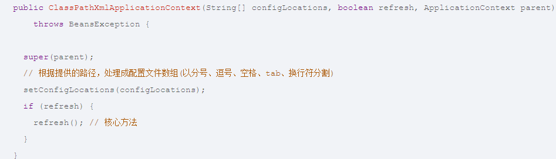

第二步： 通过AbstractApplication的obtainFreshBeanFactory方法解析成一个个bean

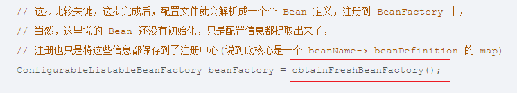

第三步： 通过AbstractApplication的FinishBeanFactoryInitializtion方法初始化bean

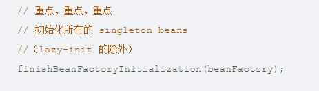

## AOP

​		面向切面编程，就是能够将那些与业务无关，却为业务模块所共同调用的逻辑或责任（例如事务处理，日志管理，权限控制等）封装起来，便于减少系统的重复代码，降低模块间的耦合度，并有利于未来的可拓展性和可维护性。

# springmvc

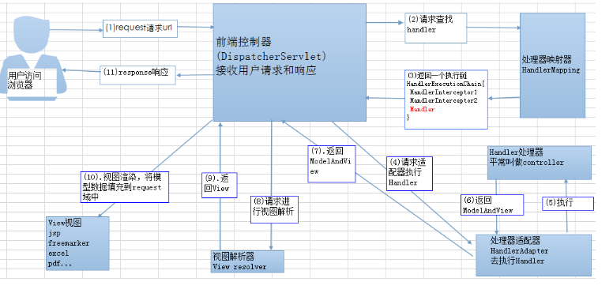

流程说明：

​	1.客户端（浏览器）发送请求到前段控制器DispatcherServlet

​	2.DispatcherServlet收到请求调用HandlerMapping处理映射器

​	3.处理映射器找到具体的处理器

​	4.Dispathcherserlvet调用HandleAdapter处理器适配器

​	5.HandlerAdpter经过适配调用具体的处理器（Controller ，也叫后端控制器）

​	6.controller 执行完成返回ModelAndView

​	7.HandlerAdpter将controller执行结果ModelAndView返回给DispatcherServlet

​	8.DispatcherServlet将ModelAndView传给ViewReslover视图解析器

​	9.viewReslover解析后返回具体view

​	10.DispatcherServlet根据view进行渲染视图

​	11.DispatcherServlet响应用户

​	

首先通过客户端发送请求到前段控制器（DispathcerServlet），前端控制器收到请求去执行handleMapping（处理器映射器），处理器映射器去获取注解或者xml配置，得到controller并且返回给Dispathcerservlet,DispthcerSerlver经过适配器调用具体的处理器（controller） ，controler返回一个ModelAndView,把ModelAndView返回给DispathcerServlert，然后dispatherSerlvert将ModelAndView传给视图解析器，视图解析器执行后返回具体的视图（view），前端控制器DispathcerSerlvert渲染视图并且响应给客户端 

# spring事务

## 		Spring事务的隔离级别

​		spring中定义了五个表示隔离等级的常数		

-  **TransactionDefinition.ISOLATION_DEFAULT：**使用层次数据库默认的隔离级别，Mysql默认采用Repeatable_Read隔离级别，Oralce默认采用Read_committed隔离级别
- **TransactionDefinition.ISOLATION_READ_UNCOMMITTED：** 最低的隔离级别，允许重新提交已提交的数据变更，可能导致脏读，幻读或不可重复读
- **TransactionDefinition.ISOLATION_READ_COMMITTED：** 允许读取并发事务以及提交的数据，可以阻止脏读，幻读或不可重复读仍然可能发生
- **TransactionDefinition.ISOLATION_REPEATABLE_READ：** 对同一段的多次读取结果都是一致的，除非数据时被本身事务自己所修改，可以阻止脏读和不可重复读，但幻读仍有可能发生
- **TransactionDefinition.ISOLATION_SERIALIZABLE：** 最高的隔离等级，完全服从ACID的隔离等级，所有的事务依次执行，可以防止脏读，不可重复读以及幻读

# Oauth2.0理论要知道点

# Token  jwt  

​	cookie是一个非常具体的东西，指的就是浏览器里面能永久存储的一种数据，仅仅**是浏览器实现的一种数据存储功能       cookie一般用在存储客户端登录信息**   

​	seesion 是一种规范，它在不同的系统处理方式不同，主要的作用就是通过服务端记录用户的状态

​	token 主要作用是基于Token的身份验证   是一种不需要存放seesion信息就能实现身份验证 

​		

jwt 本质上就是一段签名的JSON格式的数据，由于它是带有签名的，因此接受者便可以验证它的真实性

## jwt 的组成

​	jwt是由三部分构成:

​	1.Header： 描述jwt的元数据，定义了生成签名的算法以及Token的类型

​	2.Payload(负载):用来存放实际需要传递的数据

​	3.Signature(签名)： 服务器通过Payload，Header和一个秘钥（secret）使用Header里面指定的签名算法生成（HMAC SHA256）

# Nginx 限流配置

参考：https://www.cnblogs.com/biglittleant/p/8979915.html

https://baijiahao.baidu.com/s?id=1667474456667206690&wfr=spider&for=pc

负载均衡：将请求分摊到各个服务，提高吞吐量，增加网络处理请求

高并发系统中三把利器用来保护系统，缓存，降级，限流

​	**缓存**

缓存比较好理解，在大型高并发系统中，如果没有缓存数据库将分分钟被爆，系统也会瞬间瘫痪。使用缓存不单单能够提升系统访问速度、提高并发访问量，也是保护数据库、保护系统的有效方式。大型网站一般主要是“读”，缓存的使用很容易被想到。在大型“写”系统中，缓存也常常扮演者非常重要的角色。比如累积一些数据批量写入，内存里面的缓存队列（生产消费），以及HBase写数据的机制等等也都是通过缓存提升系统的吞吐量或者实现系统的保护措施。甚至消息中间件，你也可以认为是一种分布式的数据缓存

  **降级**

服务降级是当服务器压力剧增的情况下，根据当前业务情况及流量对一些服务和页面有策略的降级，以此释放服务器资源以保证核心任务的正常运行。降级往往会指定不同的级别，面临不同的异常等级执行不同的处理。根据服务方式：可以拒接服务，可以延迟服务，也有时候可以随机服务。根据服务范围：可以砍掉某个功能，也可以砍掉某些模块。总之服务降级需要根据不同的业务需求采用不同的降级策略。主要的目的就是服务虽然有损但是总比没有好。

 **限流**

限流可以认为服务降级的一种，限流就是限制系统的输入和输出流量已达到保护系统的目的。一般来说系统的吞吐量是可以被测算的，为了保证系统的稳定运行，一旦达到的需要限制的阈值，就需要限制流量并采取一些措施以完成限制流量的目的。比如：延迟处理，拒绝处理，或者部分拒绝处理等等

nginx 漏桶算法

Gateway是令牌桶

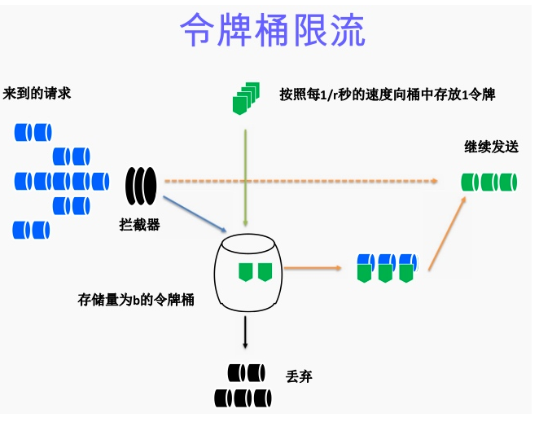

算法思想是：

- ​	令牌以固定速率产生，并缓存到令牌桶中
-    令牌桶放满时，多余的令牌被丢弃
-    请求要消耗等比例的令牌才能被处理
-    令牌不够时，请求被缓存

 桶是用来存放令牌的，队列是用来存放请求的

Nginx 官方版本限制ip的连接和并发有两个模块 限制访问频率   限制并发连接数

- ​	limit_req_zone  用来限制单位时间内请求数量，即速率限制采用漏桶算法
- ​    limit_req_conn  用来限制同一时间连接数，即并发限制 

# 微服务网关（Gateway）

​	优点 

​		1.提供了统一访问入口，降低了服务器受攻击面积

​		2.提供了统一跨域解决方案

​		3.提供了统一日志记录操作，可以进行统一监控

​		4.提供了统一权限认证支持

​		5.提供了微服务限流功能，可以保护微服务，防止雪崩效应发生

​		6.微服务网关最主要作用，把各个服务和网关组成一套系统