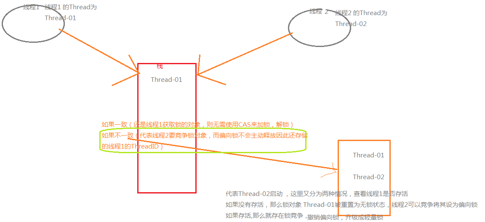
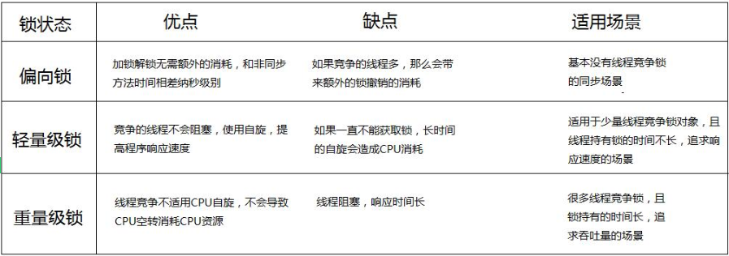
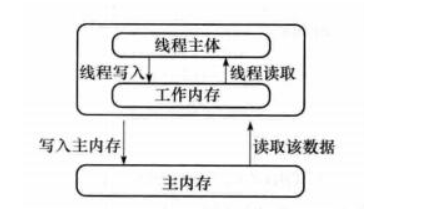

# java线程  并发

​	了解	  如自旋锁、适应性自旋锁、锁消除、锁粗化、偏向锁、轻量级锁

# 锁的优化：

​		参考：https://blog.csdn.net/tongdanping/article/details/79647337

## 	1.锁升级

​		锁的4种状态： 无锁状态，偏向锁状态，轻量级锁状态，重量级锁状态（级别从低到高）

### 无锁

无锁是指没有对资源进行锁定，所有的线程都能访问并修改同一个资源，但同时只有一个线程能修改成功。

无锁的特点是修改操作会在循环内进行，线程会不断的尝试修改共享资源。如果没有冲突就修改成功并退出，否则就会继续循环尝试。如果有多个线程修改同一个值，必定会有一个线程能修改成功，而其他修改失败的线程会不断重试直到修改成功。

### 	  偏向锁	

  **为什么要引入偏向锁？**

​	 因为经过HotSpot的作者大量的研究发现，大多数时候是不存在锁竞争的，常常是一个线程多次获得同一个锁，因此如果每次都要竞争锁会增大很多没有必要付出的代价，为了降低获取锁的代价，才引入的偏向锁

  **偏向锁的升级**

​		当线程1访问代码块并获取锁的对象时，会在java对象头和栈帧中记录偏向的锁的ThreadID，因为偏向锁不会主动释放锁，因此以后线程1再次获取锁的时候，需要比较当前线程的ThreadID和java对象头中的ThreadID是否一致，如果一致（还是线程1获取锁的对象），则无需使用CAS来加锁，解锁，如果不一致（其他线程，如线程2要竞争锁对象，而偏向锁不会主动释放因此还是存储的线程1的ThreadId）那么需要查看java对象头中记录的线程1是否存活，如果没有存活，那么锁对象被重置为无锁状态，其他线程（线程2）可以竞争将其设置为偏向锁，如果存活，那么立刻查找该线程（线程1）的栈帧信息，如果还是需要继续持有这个锁对象，那么暂停当前线程1，撤销偏向锁，升级为轻量锁，如果线程1不再使用该锁对象，那么将锁对象状态设为无锁状态，重新偏向锁新的线程。

​	简单的概括： **在没有别的线程竞争的时候，一直偏向当前线程，当前线程可以一直执行，如果存在别的线程竞争的话，那么就会把偏向锁升级成轻量锁**

### 	轻量锁

​		**为什么要引入轻量级锁（也叫自旋锁）？**

​			轻量级锁考虑的是竞争对象的线程不多，而且线程持有锁的时间也不长的情景，因为阻塞线程需要CPU从用户状态转到内核态，代价较大，如果刚刚阻塞不久这个锁就被释放了，那这个代价就有点得不偿失了，因此这个时候就干脆不阻塞这个线程，让它自旋等待锁释放

​		**轻量级锁什么时候升级为重量锁？**

​	线程1获取轻量级锁时会先把锁对象的**对象头MarkWord复制一份到线程1的栈帧中创建的用于存储锁记录的空间**（称为DisplacedMarkWord），然后**使用CAS把对象头中的内容替换为线程1存储的锁记录（**DisplacedMarkWord**）的地址**；

如果在线程1复制对象头的同时（在线程1CAS之前），线程2也准备获取锁，复制了对象头到线程2的锁记录空间中，但是在线程2CAS的时候，发现线程1已经把对象头换了，线程2的CAS失败，那么线程2就尝试使用自旋锁来等待线程1释放锁。

但是如果自旋的时间太长也不行，因为自旋是要消耗CPU的，因此自旋的次数是有限制的，比如10次或者100次，如果自旋次数到了线程1还没有释放锁，或者线程1还在执行，线程2还在自旋等待，这时又有一个线程3过来竞争这个锁对象，那么这个时候轻量级锁就会膨胀为重量级锁。重量级锁把除了拥有锁的线程都阻塞，防止CPU空转。

​	简单点概括： 线程持有锁的状态不长，因为阻塞线程需要CPU从用户状态转到内核态，代价较大，让它自旋等待锁释放  ，这个叫做轻量锁

### 重量锁

​	轻量级锁膨胀之后，就升级为重量锁了，

​	重量级锁依赖对象内部的monitor锁来实现的，而monitor又依赖操作系统的MutexLock（互斥锁)来实现的，所以重量级锁也被称为互斥锁

synchronized就是一个典型的重量级锁 

### 锁的优缺点

## 2.锁粗化

按理来说，同步块的作用范围应该尽可能小，仅在共享数据的实际作用域中才进行同步，这样做的目的是为了使需要同步的操作数量尽可能缩小，缩短阻塞时间，如果存在锁竞争，那么等待锁的线程也能尽快拿到锁。 
但是加锁解锁也需要消耗资源，如果存在一系列的连续加锁解锁操作，可能会导致不必要的性能损耗。 
锁粗化就是将多个连续的加锁、解锁操作连接在一起，扩展成一个范围更大的锁，避免频繁的加锁解锁操作。

## 3.锁消除

Java虚拟机在JIT编译时(可以简单理解为当某段代码即将第一次被执行时进行编译，又称即时编译)，通过对运行上下文的扫描，经过逃逸分析，去除不可能存在共享资源竞争的锁，通过这种方式消除没有必要的锁，可以节省毫无意义的请求锁时间

## 4.注意事项

***注意：**为了避免无用的自旋，轻量级锁一旦膨胀为重量级锁就不会再降级为轻量级锁了；偏向锁升级为轻量级锁也不能再降级为偏向锁。一句话就是锁可以升级不可以降级，但是偏向锁状态可以被重置为无锁状态。

# volatile关键字

## 		1.java内存模型

​				java的内存模型实现总是从主存（即共享内存）读取变量，是不需要进行特别注意的，而在当前的java内存模型下，线程可以把变量保存**本地内存**中，而不是直接在主存中进行读写，这就可能造成一个线程在主存中修改了一个变量的值，而另外一个线程还继续使用它在寄存器中的变量值的拷贝，造成**数据不一致**

### volatile主要作用

**保住变量的可见性还有一个防止指令的重排序**

​	1.保证此变量对所有线程的可见性，这里的“可见性”是指当一个线程修改了这个变量的值，volatile保证了新值能立即同步到主内存，以及每次使用前立即从主内存刷新，但普通变量做不到这点，普通变量的值在线程间传递都需要通过主内存来完成

​	2.防止指令重排序优化，有volatile修饰的变量，赋值后多执行了一个“load addl $0x0, (%esp)”操作，这个操作相当于一个**内存屏障**（指令重排序时不能把后面的指令重排序到内存屏障之前的位置），只有一个CPU访问内存时，并不需要内存屏障；（什么是指令重排序：是指CPU采用了允许将多条指令不按程序规定的顺序分开发送给各相应电路单元处理）

### volatile 性能：

　　volatile 的读性能消耗与普通变量几乎相同，但是写操作稍慢，因为它需要在本地代码中插入许多内存屏障指令来保证处理器不发生乱序执行。

## 2.并发编程的三个重要特性

### 		原子性

​				一个操作或者多个操作，要么所有的操作全部都得到执行并且不会收到任何因素的干扰而中端，要么所有的操作都执行，要么都不执行，Synchronized可以保证代码片段原子性

### 		可见性

​			当一个变量堆共享变量进行了修改，那么另外的线程都是立即可以看到修改后的最新值，volatile关键字可以保证共享变量的可见性

### 			有序性

​			代码在执行的过程中的先后顺序，java在编译器以及运行期间的优化，代码的执行顺序未必就是编写代码时候的顺序，volatile关键字可以禁止指令进行重排序

## 3.synchronized和volatile区别

​	synchronized关键字和volatile关键字是两个互补存在，而不是对立的存在：

- ​	volatile 关键字是线程同步的轻量级实现，所有volatile性能肯定比synchronized关键字要好，但是volatile关键字只能用于变量而synchronized关键字可以修饰方法以及代码块，synchronized关键字在javaSE1.6之后进行了主要包括为了减少获得锁和释放锁带来的性能消耗而引入的偏向锁和轻量级锁以及各种优化效率有了显著提升，实际开发中使用synchronized关键字的场景还是更多一些
- 多线程访问volatile关键字不会发生阻塞，而synchronized关键字可能发生阻塞
- volatile关键字能保证数据的可见性，但不能保证数据的原子性，synchronize关键字两者都能保证
- volatile关键字主要用于解决变量在多个线程之间的可见性，而synchronized关键字解决的是多个线程之间访问资源的同步性

